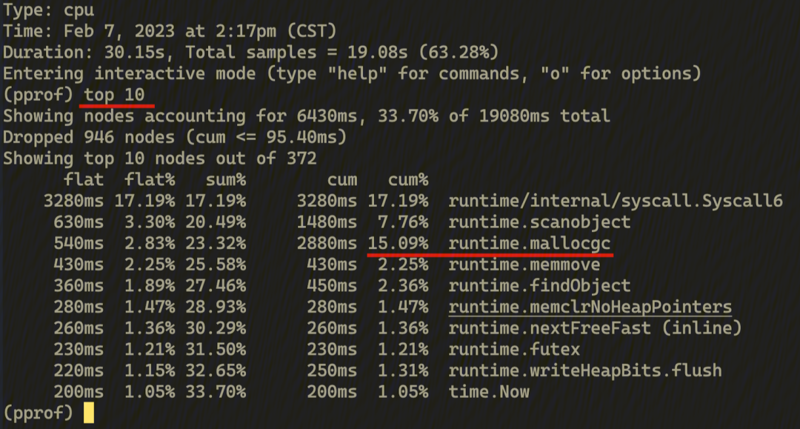
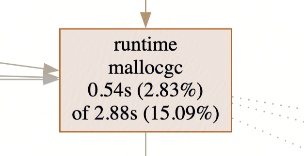
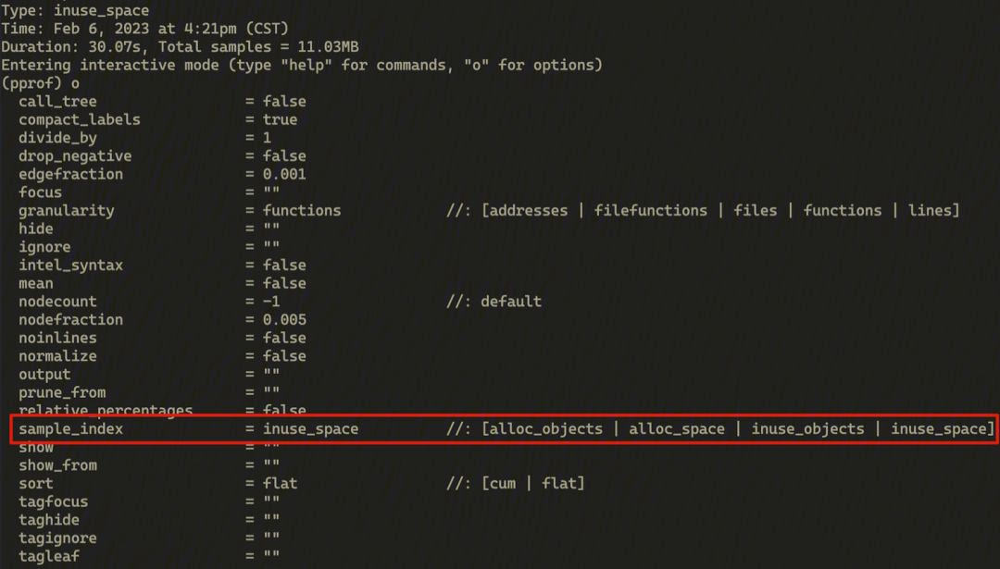

## 🌟 AI 相关

[GPT-4 Technical Report](https://ar5iv.labs.arxiv.org/html/2303.08774)

[Today's top trending papers in Computer Science](https://trendingpapers.com/papers?o=pagerank_growth&pd=Since%20beginning&cc=Cited%20and%20uncited%20papers&c=All%20categories)

## ⭐️ Go & 云原生 & Rust 相关

[小红书可观测 Metrics 架构演进，如何实现数十倍性能提升](https://mp.weixin.qq.com/s/uJ1t0B8WBBryzvbLWDfl5A)

[Java与Go到底差别在哪，谁要被时代抛弃](https://mp.weixin.qq.com/s/JkpzM06IWNb11wUaJWJn8Q)

既然问题是 GC 占用的 CPU 过高，首先我们分析一下 CPU 热点，进一步确认一下问题。

```bash
$ go tool pprof -seconds 30 https://<测试域名>/debug/pprof/profile
```

这个命令用于进行 30s 的 CPU 性能分析，在完成之后会进入 profile 的交互工具：



这里直接输入 top 10 可以输出 flat 占比最高的 10 个函数，可以看到 runtime.mallocgc 的 cum 占比已经达到了 15%，占用了快到 3s CPU 时间。

Flat vs Cum：
- Flat 占比是指这个函数自身的代码使用了多少 CPU，不计算子函数的耗时。
- 而 Cum 则代表这个函数实际执行消耗了多少 CPU，也就是包括了所有的子函数（和子函数的子函数...）的耗时。

交互工具这里输入 web 就会自动生成调用图（callgraph）并在浏览器里打开 ，限于文档空间这里只展示重要的部分 ：


先分析一下主流程，这里业务逻辑一共占用了 54% 左右的 CPU（最上面的 endpoint.handler 方法），再往下看，其中 33% 是 RPC 调用（左下角的 client.Invoke），12% 是结果输出（右边的 endpoint.httpOutput，包括写出 HTTP Response，日志上报，监控）。剩下 9% 左右就是实际的各种业务逻辑了，因为非常分散且没有集中的点，所以图上没有显示出来。

纵观这个图可以看出，除了 HTTP/RPC 网络调用占用了大部分 CPU 外，并没有其他很明显的 CPU 热点，这就让最后一个热点凸显了出来：



GC 占用的 CPU 在这次 Profiling 过程中占了 15%，比业务逻辑还高！到这里基本确认，GC 一定存在某些问题。

我们可以用另一个 pprof 工具 allocs 来确认猜测是否成立，这个工具会记录堆上的对象创建和内存分配，只需要把上面的 HTTP Path 最后的 profile 换成 allocs 即可：

```bash
$ go tool pprof -seconds 30 https://<测试域名>/debug/pprof/allocs
```

和 CPU Profile 不一样，Allocs 的 Profile 会记录四个不同的信息，可以输入 o 查看 sample_index 的可选值：



- alloc_object：新建对象数量记录；
- alloc_space：分配空间大小记录；
- inuse_object：常驻内存对象数量记录；
- inuse_space：常驻内存空间大小记录。

一般来说，inuse 相关的记录可以用于排查内存泄漏，OOM 等问题。这里我们是 GC 的问题，主要和内存申请和释放有关，所以先看下 alloc_space：

输入命令，sample_index=alloc_space，然后再 top 10 看下：


可以发现，这 30s 一共申请了 1300M 的内存，其中绝大多数都是框架和框架组件，比如 RPC 的网络读取（consumeBytes, ReadFrame），pb 的解析和序列化（marshal），名字服务的选址（Select），日志输出（log），监控上报（ReportAttr）。也没有明显的可疑对象。

我们进行一些简单计算：进行 profiling 的线上节点是 2C2G 配置，看监控单节点大约是 800 QPS 的流量，所以 30s 就是 2w4 的请求，申请了 1300M 的空间，平均一个请求就是大约 50KB 左右。

这个量也比较合理，毕竟一次请求我们需要储存 HTTP 包内容，解析成结构体，还需要调用两次 RPC 接口，最后做日志写出和监控上报，最后再给出返回值，50KB 的资源使用并不算大。而且绝大多数都是框架使用，即使用对象池把业务上的一些小对象复用，对这个内存申请也影响不大。

虽然这个步骤没有排查到想查的问题，但是却发现了一些其他的代码中的小问题，这里也顺便记录下。

首先，上面的 top 10 看不出任何问题，但是为了保险起见，看了一下 top 20：


这里有三个我们业务代码里的函数，flat 都很少，占比加起来也不到 4.5%，不过既然发现了他们 ，就深入看一下函数里各行的分配情况，看看有没有什么问题。

[只改一个参数让Golang GC耗时暴降到1/30！](https://mp.weixin.qq.com/s/EEDNuhEr0G4SbTzDhVBjbg)

[字节跳动云原生成本治理落地实践](https://mp.weixin.qq.com/s/GFYudlHBuIr_bDe6IX4mlw)

[Go 的 DDD 工程化项目实践](https://juejin.cn/post/7298160530292703244)

[Rust 的所有权、借用和生命周期](https://juejin.cn/post/7279313746450235403)

[Kubernetes Deployment 滚动更新实现原理](https://mp.weixin.qq.com/s/c4LWdwACitC2gH2tDu3E8g)

[\[go 面试\] 分布式事务框架选择与实践](https://mp.weixin.qq.com/s/vQz2-KhRenuimU7jvHtkkQ)

[我是如何实现Go性能5倍提升的](https://mp.weixin.qq.com/s/SlPdSoMs1po1l19uaNMrIQ)

[完善 Golang Gin 框架的静态中间件：Gin-Static](https://mp.weixin.qq.com/s/4ZT1Pu_lR56LmIQjFmy9Kg)

[Kubernetes 为什么需要 Ingress](https://mp.weixin.qq.com/s/uuB97dnIHe0hxsoBrk6THg)

[Uber Go 出了个静态分析工具 NilAway，还挺实用！](https://mp.weixin.qq.com/s/vDmSnZZXg1EnyeFMuj6orw)

[Go语言中常见100问题-#93 Not taking into account instruction-level](https://mp.weixin.qq.com/s/oVSJz7MIUR7HNhU-hKnCJg)

[Rust使用gRPC](https://mp.weixin.qq.com/s/a_v6_F6nqGlDcBUKyEQF2w)

[这些流行的K8S工具，你都用上了吗](https://mp.weixin.qq.com/s/6bgFUadhbCqDAwNgGsXgGg)

[Go测试的20个实用建议](https://mp.weixin.qq.com/s/yJqwcYqYmV1wWuo147fX4Q)

[『每周译Go』Go 的抢占式调度（文末有彩蛋）](https://mp.weixin.qq.com/s/d7FdGBc0S0V3S4aRL4EByA)

[了解go在协程调度上的改进](https://mp.weixin.qq.com/s/YXxFVBrwlwf3YpIUhXFmTQ)

[Go 语言为什么不支持并发读写 map](https://mp.weixin.qq.com/s/n6K6tbDRdS5c0hMtmHxdFg)

[第一篇 旧话重提：获取和利用 goroutine id, machine id 和 process id](https://mp.weixin.qq.com/s/dePs661VzQf_yi2aHsydIA)

## 📒 后端相关

[HBase深度历险 | 京东物流技术团队](https://juejin.cn/post/7315959676886450211)

项目中遇到一个问题，需要记住弹窗频控，一般来说跟着设备走，也就是在前端缓存。如果需要以用户维度，需要怎么设计，可以用 Redis Bitmap 实现。

[Redis Bitmap：实现千万级用户签到的秘密武器](https://juejin.cn/post/7273025562155466764)

[这些年在阿里学到的方法论](https://mp.weixin.qq.com/s/yPRPakU1UM5iVY-1bwiHJQ)

[架构面试：全链路压测，你是怎么设计的](https://mp.weixin.qq.com/s/MyK6QrNt3xtms_IBAb6sSQ)

[阿里面试：如何保证RocketMQ消息有序？如何解决RocketMQ消息积压](https://mp.weixin.qq.com/s/ofaQwaOobZ_5xqcor6ObhA)

[网易面试：亿级用户，如何做微服务底层架构](https://mp.weixin.qq.com/s/3w5Ld8zgc8DeTmoo7T31qw)

[美团面试：亿级数据 在线统计，如何实现](https://mp.weixin.qq.com/s/PRouD97LKd726m_aW5DWFw)

[美团面试：ES+Redis+MySQL高可用，如何试实现](https://mp.weixin.qq.com/s/SXsQ3T5SFK0SKg054m-7Mg)

[字节面试：DDD架构，如何落地](https://mp.weixin.qq.com/s/_NAHYDIvmT7EbffXkIpqYw)

[微服务下必须了解的4种部署策略！](https://mp.weixin.qq.com/s/c9sioXo95QQmZ7AyQxFBtw)

[自从用了这款链路追踪系统，睡觉真香！！](https://mp.weixin.qq.com/s/QzG3MupskxyV8eaGt2YOXw)

[逆风时刻，管理动作或成噪音](https://mp.weixin.qq.com/s/EtPcGw3dYsKbd411FbZ0bA)

[这些年背过的面试题——架构设计篇](https://mp.weixin.qq.com/s/w7xUHPCZZuCX_Is1eT5uZQ)

[还得是腾讯，捞了我一把！](https://mp.weixin.qq.com/s/Qwc0xsrOVD4ZTHohAb01yw)

[文末福利丨2023哔哩哔哩技术精选技术干货](https://mp.weixin.qq.com/s/zgymXmxo5kiKPG7QRs6Uiw)

[能ping通，TCP就一定能连通吗](https://mp.weixin.qq.com/s/gLrRgfwmzMvk9T6MIY4cWg)

[微服务全做错了！谷歌提出新方法，成本直接降9倍！](https://mp.weixin.qq.com/s/rezUShZLEK_3f3Cfl2b_fw)

[备考两年，关于软考的经验都在这了](https://mp.weixin.qq.com/s/Ijh0taMzh7MUnuysjCB4gQ)

[我在阿里做开发的高效打工技巧总结](https://mp.weixin.qq.com/s/EwdKRsu_U39bTJf4hbjIeA)

[一文讲透消息队列RocketMQ实现消费幂等](https://juejin.cn/post/7313242116771627034)

[订单场景-基于Redisson实现订单号生成](https://juejin.cn/post/7307467803975843891)

## 📒 前端相关

[【第3162期】前端APM指标采集大冒险](https://mp.weixin.qq.com/s/u78Dr9DfLyCMAH8aTil5Lg)

[2023年最火的前端项目出炉，竟然是它](https://mp.weixin.qq.com/s/ENkssTfPQmS5_PjdIcXpBA)

[你的网站或许不需要前端构建（二）](https://mp.weixin.qq.com/s/2Cm7iBMTZk-YqX7G0WfwRQ)

[2023 年 Node.js 性能状态](https://mp.weixin.qq.com/s/hEYGSa__fKr67nVjR1DFWA)

[【第3157期】解锁前端新潜能：如何使用 Rust 锈化前端工具链](https://mp.weixin.qq.com/s/Zlc-G6oD63mpSUVBiOs6FA)

[前端食堂技术周刊第 110 期：Vue3.4、新版 Vue DevTools 开源、AI 2023 年度总结合集](https://mp.weixin.qq.com/s/yre8fxml3Sgykr4iG8_BSw)
