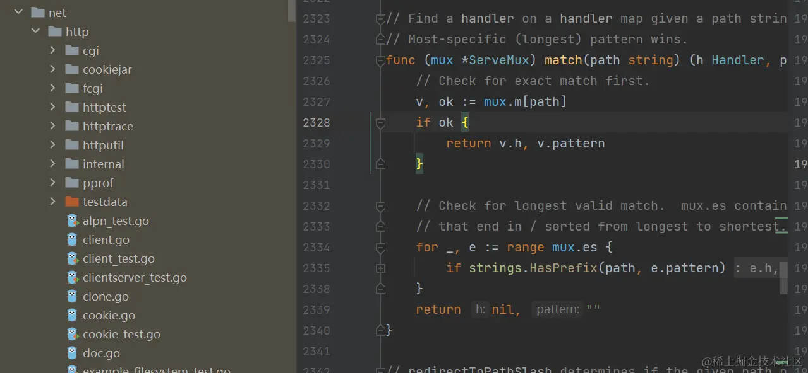

封面图：图文吃透Golang net/http 标准库--服务端

## 🌟 AI 相关

[Large Language Models for Mathematical Reasoning: Progresses and Challenges](https://arxiv.org/abs/2402.00157)

[A Comprehensive Survey of Compression Algorithms for Language Models](https://arxiv.org/abs/2401.15347)

[The Power of Noise: Redefining Retrieval for RAG Systems](https://arxiv.org/abs/2401.14887)

[Corrective Retrieval Augmented Generation](https://arxiv.org/abs/2401.15884)

[从零构建现代深度学习框架(TinyDL-0.01)](https://mp.weixin.qq.com/s/tFl0RQd3ex98_SAOIIfM_Q)

[本地运行面壁智能的“贺岁模型”：MiniCPM 2B](https://mp.weixin.qq.com/s/Z0iZR6iGSBe298eK1Er1Ow)

[「我在淘天做技术」2024年看AIGC是如何让1688主图焕发新春的](https://mp.weixin.qq.com/s/Ni_vVDlxBaoUcgoVORw31A)

[大模型推理框架RTP-LLM对LoRA的支持](https://mp.weixin.qq.com/s/em-mnps_Oqe1PLLpJ9hB-A)

[LLM之LangChain（五）| 使用LangChain Agent分析非结构化数据](https://mp.weixin.qq.com/s/chxksL3zqbwyqHev1x43kw)

[LLM之RAG理论（六）| 高级RAG指南和技巧](https://mp.weixin.qq.com/s/a5uKQAxwfsREnXd0XPhu1A)

[从零手搓MoE大模型，大神级教程来了](https://mp.weixin.qq.com/s/gDtzzSRunUrKjoIUGSHCvA)

[RAG进阶 多用户多文档](https://juejin.cn/post/7325993514702258230)

[RAG 进阶 LlamaIndex多文档](https://juejin.cn/post/7325831147563958308)

[RAG 进阶 多模态图片检索](https://juejin.cn/post/7325724706139996201)

[RAG 进阶 半结构化数据](https://juejin.cn/post/7325800661232140327)

[LlamIndex二 RAG应用开发](https://juejin.cn/post/7310347016982069288)

[LlamaIndex 一 简单文档查询](https://juejin.cn/post/7310786591940165641)

[使用 Docker 快速上手中文版 LLaMA2 开源大模型](https://mp.weixin.qq.com/s/9cTNa_oya2Zj9YdDYodCvw)

[部署必备—triton-inference-server的backend（一）——关于推理框架的一些讨论](https://mp.weixin.qq.com/s/_WStiyaAk7G-w2j6SVe4CA)

[TensorRT-LLM初探（一）运行llama，以及triton tensorrt llm backend服务化](https://mp.weixin.qq.com/s/J1EdNtAx3B0yeQ7zeSDLQg)

[H100推理飙升8倍！英伟达官宣开源TensorRT-LLM，支持10+模型](https://mp.weixin.qq.com/s/xcNQBG69XkS6mOstzqROAw)

[大语言模型推理提速：TensorRT-LLM 高性能推理实践](https://mp.weixin.qq.com/s/jnQs5XhWeAqoitahmDhziQ)

## ⭐️ Go & 云原生 & Rust 相关

[Go1.22 新特性：性能提高、Trace 大修、工作区支持 vendor 等](https://mp.weixin.qq.com/s/_RHDJ1VGfqolE_Uzorosbw)

[json.Marshal为什么会对[]byte类型进行base64编码处理](https://mp.weixin.qq.com/s/h8SNvIVN1bFy8gBUB63_NA)

[Go调度器系列解读（二）：Go 程序启动都干了些什么](https://mp.weixin.qq.com/s/PvdZ_Ay9xgrY_SrDt-Sddw)

[Go语言中的Pinner.Pin](https://mp.weixin.qq.com/s/MNuk0poC3s2tTx_DjyJAQA)

[Kubernetes 调度器队列 - 设计与实现](https://mp.weixin.qq.com/s/wQqMu41e8pnLpnAZo0GLow)

[Go语言通知协程退出(取消)的几种方式](https://mp.weixin.qq.com/s/CNTlXMWSmQ4dNbbCQpbjYg)

[Go语言中常见100问题-#97 Not relying on inlining](https://mp.weixin.qq.com/s/SC1tg6XxDi_y1bjj6lkw6w)

[程序员才懂的乐趣：10亿行的挑战](https://mp.weixin.qq.com/s/_z801oBwANP27C-BXbHNZA)

[Kubernetes 调度器 - 核心流程 (下篇)](https://mp.weixin.qq.com/s/vHr56wXPVAl-b4tbnvhS5w)

[Go调度器系列解读（一）：什么是 GMP](https://mp.weixin.qq.com/s/g4NdoFWrcGmSMeQt8q1XtA)

[Kubernetes 调度器 - 核心流程 (上篇)](https://mp.weixin.qq.com/s/4hZ6laeQc5P2o2n1yKD_8w)

[图文讲透Golang标准库 net/http实现原理 -- 服务端](https://mp.weixin.qq.com/s/e7Z_kZrayTFx7y0hlzoTdg)

[利用 ChatGPT 高效搜索Go问题：举一反三的思考方式，高效查找解决方案](https://mp.weixin.qq.com/s/b7dHVIVYsL-19gyzUujktA)

[Go语言中常见100问题-#96 Not knowing how to reduce allocations](https://mp.weixin.qq.com/s/d5nczMvDpELt8R5ZB08Yow)

[从慢速到SIMG: 一个Go优化的故事](https://mp.weixin.qq.com/s/l6Tq_bVDmMpwZg_rPfi1DQ)

## 📒 后端相关

[8种专坑同事的 SQL 写法，性能降低100倍，不来看看](https://mp.weixin.qq.com/s/jwAawzeKq_vTTYw58rvgVA)

[批量执行Redis命令的四种方式！](https://mp.weixin.qq.com/s/YF5D3RRvmVXNJ_Njsa1Txw)

[阿里面试：设计一个大并发、大数据的系统架构，说说设计思路](https://mp.weixin.qq.com/s/hmO2BKuMMU8ZPxW0lj9ZHw)

[码哥字节 124 篇优秀文章精选](https://mp.weixin.qq.com/s/mspeViqHosmh4kUI8S8ajA)

[Kafka性能篇：为何Kafka这么"快"](https://mp.weixin.qq.com/s/vzbLWE4JteqjkOFJwcgRhg)

[Redis 核心篇：唯快不破的秘密](https://mp.weixin.qq.com/s/z4VjDaDDbspFz1rIBwazIA)

[链路追踪落地过程中的挑战与解决方案](https://mp.weixin.qq.com/s/NU-W6rpwH-6_RQnSgbfZqQ)

[美团面试：Sentinel底层滑动时间窗限流算法怎么实现的](https://mp.weixin.qq.com/s/TbxisH1zzE58u7YoRi04yA)

[字节二面：Spring Boot Redis 可重入分布式锁实现原理](https://mp.weixin.qq.com/s/sMeLfLachYpUq261usr4tQ)

[纠正误区：这才是 SpringBoot Redis 分布式锁的正确实现方式](https://mp.weixin.qq.com/s/nJeRvz7jb4i2eXzc4vpdvw)

[分库分表的 21 条法则，hold 住！](https://mp.weixin.qq.com/s/W5vbjWMG86zEca3CPvAadg)

[腾讯二面：epoll性能那么高，为什么](https://mp.weixin.qq.com/s/DLmXspbokYhQ-j5tLnUMgw)

## 📒 前端相关

[扩展你的前端知识库，毫无废话！](https://mp.weixin.qq.com/s/ZkMc3-T0swxjJ4yujp1R1w)

[TypeScript 5.4 beta: NoInfer 类型、闭包类型分析优化、条件类型判断优化等](https://mp.weixin.qq.com/s/lRzS_ZoJhzHmuOx0HCDTnw)

[升级到 React 18 的经验和教训](https://mp.weixin.qq.com/s/48cn-JU3uCZkpsi30cloiQ)
