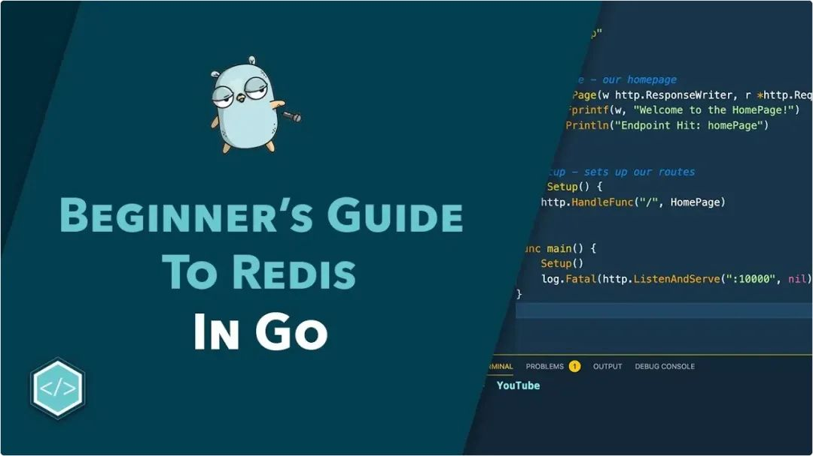

封面图：使用Redis入门Golang

## 🌟 AI 相关

[《In-context Learning with Retrieved Demonstrations for Language Models: A Survey》](https://arxiv.org/abs/2401.11624)。这篇题为 "In-context Learning with Retrieved Demonstrations for Language Models: A Survey" 的文章，主要讨论了语言模型，尤其是大型预训练语言模型如何通过获取的演示进行少量情景学习。这项技术能有效地改进学习过程的效率和可扩展性，并降低手动选择样例时的固有偏见。文章对此领域进行了广泛的研究回顾，对检索模型、检索训练过程和推理算法的不同设计选择进行了讨论和比较。

[使用 GPT4V+AI Agent 做自动 UI 测试的探索 | 京东云技术团队](https://juejin.cn/post/7316592794109198387)

[Gemini修bug神了！录网页视频把代码库甩给它就行，网友坐不住了：想要访问权限](https://mp.weixin.qq.com/s/ZSDCNDRu-tCkOlC9jz2j4w)

[一键开启 GPU 闲置模式，基于函数计算低成本部署 Google Gemma 模型服务](https://mp.weixin.qq.com/s/GXwftkv-UpDQSjiTMn9TFA)

[《Yi技术报告细节分享》](https://mp.weixin.qq.com/s/YDwL3dV-Fq5zcEyrL__NGw)。该文章分享了Yi模型的具体实现细节和思路，强调了模型设计围绕模型规模、数据规模和数据质量。Yi模型的预训练阶段数据处理流程包括启发式过滤、学习式过滤、聚类过滤以及去重等步骤，以提高数据质量。微调阶段，Yi模型仅采用了10K数据进行模型微调，强调数据质量胜过数量。在分词器、模型结构及微调参数方面，Yi模型采用了一系列优化措施，包括Transformer-Decoder结构、Grouped-Query Attention等。总的来说，Yi模型通过优化数据处理流程、微调策略、调整模型结构和参数等多方面实现了高效的技术实现。

[重新定义大模型推理！Google | 提出SELF-DISCOVER框架，大模型可自写推理结构！](https://mp.weixin.qq.com/s/lBXwSVvRHB2Yn0fYoOkDeQ)

[《斯坦福 && 微软 | 发布前端代码生成大模型：Design2Code-18B，助力前端自动化！》](https://mp.weixin.qq.com/s/cB5tgMUPqg8fsXjNrzQpbg)。这篇文章主要介绍了一种新的前端代码生成大模型：Design2Code-18B，它可以将网页视觉设计转换成功能性代码。文章首先介绍了将网页视觉设计转换成功能性代码的挑战性和现有方法的局限性，然后提出了Design2Code基准和多模态提示方法，以激发多模态大型语言模型（如GPT-4V和Gemini）的潜力。接着，文章介绍了开源的18B微调模型Design2Code-18B，它基于CogAgent-18B，在多种数据集上进行了预训练，并使用了Huggingface发布的WebSight数据集进行微调。最后，文章展示了Design2Code-18B在Design2Code基准上的优越性能，并提供了一些未来研究方向。

[可控文本生成新方法，人大&&南开 | 提出DATG架构，准确性提升19.29%，效率提升1倍](https://mp.weixin.qq.com/s/Pdp6_z_rxBl-kph41Lb8Ww)

[《Auto-Prompt | 大模型提示(Prompt)优化新方法IPC：可根据用户意图进行定向优化》](https://mp.weixin.qq.com/s/53jEDw58dkZlJAVzr31G8A)。这篇文章提出了一种名为 Intent-based Prompt Calibration（IPC）的系统，主要目的是通过使用合成案例样本来优化大型语言模型的提示工程。它基于模型生成的数据集进行提示优化，以解决大语言模型对给定提示的敏感性等问题。这种方法的核心思想是根据用户意图迭代细化提示。同时，文章还对 IPC 系统的整体架构和实现流程进行了详细介绍，并展示了一些实验结果。

[《更智能的 Agent，Plan-and-Execute Agents 计划和执行》](https://mp.weixin.qq.com/s/1d2_kHEQnug9iR0cU_0nAA)。这篇文章介绍了几种新型的智能 Agent 设计方法，包括 Plan-and-Execute Agents、ReWOO Agent 和 LLMCompiler。Plan-and-Execute Agent 设计法通过明确规划来优化智能 Agent 功能。ReWOO Agent 设计法凭借变量分配功能使得不必对每个任务都使用 LLM。LLMCompiler 则通过任务格式化为 DAG 来提高工具调用的效率。这些新型设计都在不同程度上优化了智能 Agent 的工作流程，提高了工作效率。

[《OpenAI Function Calling 与 LangChain Agent 工作原理及区别》](https://mp.weixin.qq.com/s/F2s3pKycoNDT7Z-6piRHWg)。这篇文章介绍了OpenAI Function Calling 与 LangChain Agent的工作原理及它们之间的区别。文章首先列举了大型语言模型的限制，并解释了为何需要Agent。然后，文章介绍了React Agent的工作方式，通过“Reason Only”（向内求索）、“Act Only”（向外探索）和“ReAct”（内外兼修）三种模式优化模型的功能。此外，文章还以一个简单的实例，解释了如何利用ReAct Agent来解答一个包含搜索和计算两个步骤的问题，展示了其实际应用的流程。

[《ReAct Agent 回答 RAG 系统中的复杂问题》](https://mp.weixin.qq.com/s/iM45toKEHr3_rJxuwbgp4w)。这篇文章主要讲述了“ReAct Agent 用于回答 RAG 系统中复杂问题的方式”。随着输入问题的复杂度升高，使用传统的聊天机器人已不能足够有效。于是，作者提出了利用 ReAct Agent，通过自然语言模型（LLMs）逐步规划并执行处理问题的步骤，并定义功能性工具（如时间计算、文本搜索、列表长度计算、百分比变化计算等）以辅助任务完成。这种方法能够更好地干预和控制问题的解决过程，从而提高任务的完成质量。

[更智能的 Agent，Plan-and-Execute Agents 计划和执行](https://mp.weixin.qq.com/s/1d2_kHEQnug9iR0cU_0nAA)

[ChatGPT也能画图？教你一键生成时序图、类图、流程图、状态图以及用例图](https://mp.weixin.qq.com/s/KF7joY-MkK4BZ8Rf8bLArw)

[三个被忽视的大模型提示](https://mp.weixin.qq.com/s/E2xwi9SNYQ7sdzhYlaDQFg)

[关于Sora和Stable Diffusion 3，你需要知道的一切](https://mp.weixin.qq.com/s/u2LCRgBhKKcGZhY29PjIng)

[消费级显卡可用！李开复零一万物发布并开源90亿参数Yi模型，代码数学能力史上最强](https://mp.weixin.qq.com/s/z6IFIuHawVZI6ZOfgvgKuA)

[详解大模型微调全流程](https://mp.weixin.qq.com/s/IBh3ytd3gtizAQd5PI2uig)

[南大俞扬教授：什么是world models/世界模型](https://mp.weixin.qq.com/s/UzC3J_TOzJPEx_86-lRwuw)

[深入浅出LangChain与智能Agent：构建下一代AI助手](https://mp.weixin.qq.com/s/Gi6pzD7wAMyzlCBSSWkVLA)

[尤洋教授：开源完整的Sora复现方案来了！](https://mp.weixin.qq.com/s/T9YRVRGMgkwRSTl7Movadg)

[《T-RAG=RAG+微调+实体识别》](https://mp.weixin.qq.com/s/8WYWrHyE4oryCgO9AemImA)。这篇文章名为"T-RAG=RAG+微调+实体识别"，主要介绍了T-RAG技术，这是一种将RAG架构与微调语言模型和实体树向量数据库相结合的方法，用于支持语境检索。它概述了在敏感文档的背景下如何保护数据隐私，以及如何在有限的计算资源和基于现有文档建立的小型训练数据集中保证用户提问的准确回答。文中还着重介绍了T-RAG的工作流程和实体树的作用。最后，还提出了一个新的评估指标“Correct-Verbose”，用以评价生成回复的质量。此研究不仅是理论研究，也是实践中LLM应用的经验总结，具有实际的指导意义。

[《高级 RAG（Self-Reflective RAG）》](https://mp.weixin.qq.com/s/de3UxM9WTrHNjnOKSny0aw)。这篇文章名为"高级 RAG(Self-Reflective RAG)"，主要介绍了Self-Reflective RAG的理念和工作流程。在基本的RAG pipeline中，我们的过程往往受限于被动的检索和生成，而实际操作中，我们需要根据生成的结果进行优化，如改变问题或筛选和排列内容。为了解决这个问题，文章介绍了一种新的自我修正框架，包括Corrective RAG(CRAG)和Self-Reflective RAG。这两种RAG都围绕着对检索和生成内容的评估和反馈进行自我修正，并通过特定标识进行调控。在一定条件下，进一步改进了RAG，使其产生更好的检索和生成效果。

[RAG不够聪明？打造更强大的智能体](https://mp.weixin.qq.com/s/WuJEubctUDsAmdhHcDItAg)

[Anthropic发布Claude3，效果已超越GPT4](https://mp.weixin.qq.com/s/b_eWGauwi6v0w4CoSOnU5w)

[从0开始预训练1.4b中文大模型实践](https://mp.weixin.qq.com/s/nMWTuKBnQVjgAM7Du6oOFQ)

[分类算法入门：以鸢尾花数据集为例](https://mp.weixin.qq.com/s/W5W582CqxvRhF3wnKwIdiQ)

[《万字详解LLM Agents的现状，问题与未来》](https://mp.weixin.qq.com/s/fkRG7n4tOQKwU85xiEx0Eg)。这篇文章名为"写在跨年之前：聊聊LLM Agents的现状，问题与未来"，主要涉及到LLM Agents的当前状态，面临的问题和未来的可能发展。文章探讨了包括全参微调、Prompt Tuning、LoRA、P-Tuning等在内的SFT(Selective Fine Tuning)范畴的各种技术。其中尤其强调了对于{prompt，response}的单轮问答对的微调是最简单的SFT实现方式。具体的内容细节大概需要阅读原文才能获得更深入的理解。

## ⭐️ Go & 云原生 & Rust 相关

[听GPT 讲Rust源代码--compiler(6)](https://mp.weixin.qq.com/s/IH1FGDpClrsnlfjg7OF3lg)

[使用Apache Kafka的Golang实践指南](https://mp.weixin.qq.com/s/JCU3dwkwpMP3qMKqg9ed6g)

[Go 为什么不支持从 main 包中导入函数](https://mp.weixin.qq.com/s/RFsHfFByarSRAA-f1Rs13g)

[fasthttp是如何做到比net/http快十倍的](https://mp.weixin.qq.com/s/zxLO4IhLqQmIaUDzwwjU1w)

[《万字长文讲解Golang pprof 的使用》](https://mp.weixin.qq.com/s/fx-FTVpM3CXIPUwTC_juDQ)。这篇文章主要讲述了Golang的pprof工具的使用。pprof工具是Golang中用于性能分析的一个工具，它可以分析出cpu使用情况、内存占用、阻塞情况、线程和协程等信息。文章中详细阐述了如何使用此工具，主要有两种方式，一种是通过http接口的方式暴露出pprof的采集控制界面，另一种是在程序中通过代码来启动相应指标的采集示例。文章还详细介绍了如何解析通过这两种方式获取的输出信息。本文的主要目的是将pprof工具的使用方式用思维导图的形式展示出来，这样可以帮助读者更好地理解和使用pprof工具。

[如何使用 K8s 两大利器"审计"和"事件"帮你摆脱运维困境](https://mp.weixin.qq.com/s/6xx3-qow8A5Hdp_72jswow)

[【Go 工具】竞态条件检测神器 Race Detector](https://mp.weixin.qq.com/s/lxEAFe2Ewmc8YvTqn8UcLQ)

[使用Redis入门Golang](https://mp.weixin.qq.com/s/Y67J4_D1yyMa-eb7XmgTcA)

[一道面试题: Top K 问题](https://mp.weixin.qq.com/s/qDFM-nVo-jeh9VdcBfMreA)

[理解 Docker 容器中 UID 和 GID 的工作原理](https://mp.weixin.qq.com/s/sTd3SVh0swGTnaGugsw1SA)

[如何基于Docker镜像逆向生成Dockerfile](https://mp.weixin.qq.com/s/yUuo1IjeXY78_5u4QpkuTA)

[通过多阶段构建减小Golang镜像的大小](https://mp.weixin.qq.com/s/KkRWQyljuo86-XbBxEnGPA)

[《k8s 到底是什么，架构是怎么样的》](https://mp.weixin.qq.com/s/dckA1ezcABndN5WSg1BOBA)。这篇文章主要讨论了 Kubernetes（k8s）及其架构，详细解释了 Kubernetes 是如何在应用服务与服务器之间充当中介层，实现了对多个服务的自动部署、扩展和管理。Kubernetes 将服务器区分为控制平面（master）和工作节点，API 服务器、调度器、控制器管理器、etcd、容器运行时、Kubelet 和 Kube 代理等组件在 Kubernetes 生态系统中负责各种任务。

[《Go 泛型有没有可能在后期改为 `<>` 尖括号》](https://mp.weixin.qq.com/s/vjmntyGwzURz_elg27vpXg)。这篇来自陈煎鱼的技术博客名为"Go 泛型有没有可能在后期改为 `<>` 尖括号？"，主要探讨了Go语言是否可能将泛型的语法从使用方括号 `[]` 改为使用尖括号 `<>`，并深入讨论了Go语言不使用尖括号的原因，如解析歧义和兼容性问题。同时，文章也指出，Go语言在未来似乎不太可能将泛型的语法改为尖括号。

[Rust中channel的使用](https://mp.weixin.qq.com/s/arI9sip-5JH9YSu45XJ83w)

[K8s部署方式大全：从基础到进阶，一文带你掌握所有技巧](https://juejin.cn/post/7272006755266002959)

[k8s从入门到精通 -- 更适合中国宝宝体质](https://juejin.cn/post/7301584578342289423)

## 📒 后端相关

[万字+33张图探秘OpenFeign核心架构原理](https://mp.weixin.qq.com/s/NABg5tGizHsmdXgUO6NeVw)

[三万字长文：如何去排查JVM内存问题](https://mp.weixin.qq.com/s/1Qe29y3nrbi39Kpaspme7Q)

[如何避免MYSQL主从延迟带来的读写问题](https://mp.weixin.qq.com/s/WLPo8s_M3AzxwB3o3ehY3w)

[这些年背过的面试题——ES篇](https://mp.weixin.qq.com/s/dt_14etV_2ynAmyMa_uyug)

[什么是MySQL锁？有哪些锁类型](https://mp.weixin.qq.com/s/gAJFm3q5510PfRBe4F11PQ)

## 📒 前端相关

[Vue 团队正式开源 Rolldown：基于 Rust 的超快 JavaScrip 打包工具！](https://mp.weixin.qq.com/s/m-Ae6dbFuW22u2xSDWcciw)

[打造舒适的vscode开发环境](https://mp.weixin.qq.com/s/MVR5rV2LkH8_GHCtP6SHug)

[相比于 Node.js，Deno 和 Bun 到底能带来什么](https://mp.weixin.qq.com/s/pY4-RqqamTmPXnRPfw0hRA)

[MDH Weekly 122 - 《招人》](https://mp.weixin.qq.com/s/yBTK4Rds28aJ88mVgkoYJA)
