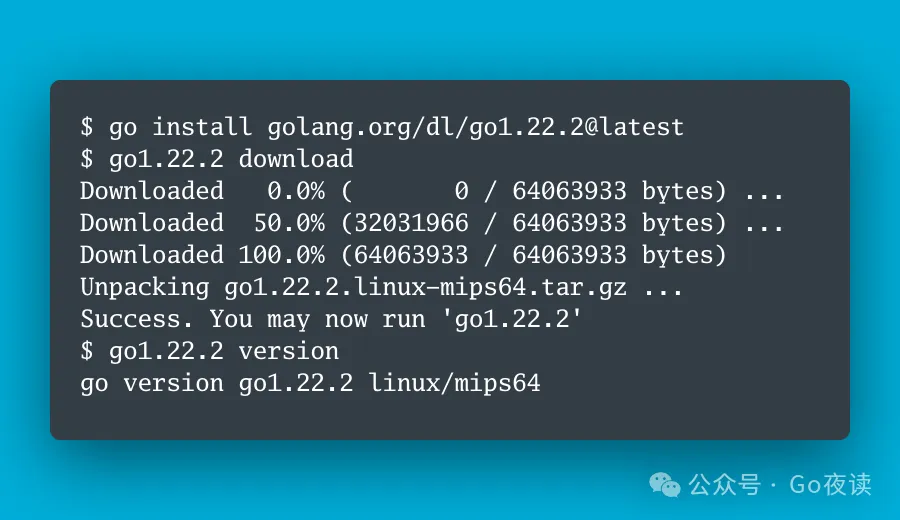

封面图：Go 1.22.2 刚刚已发布，修复 http2 多个 header 导致的连接关闭

## 🌟 AI 相关

[人工智能机器学习算法总结--1.线性回归算法(单变量及多变量)](https://mp.weixin.qq.com/s/XMrbHWIUDELs8NqOEqR-aA)

[RAG实践中的关键模块解析](https://zhuanlan.zhihu.com/p/682253496)

[用扣子/Coze 揭秘吴恩达的4种 AI Agent 设计模式](https://mp.weixin.qq.com/s/OtdncYNt9KDE6YzDJeexFg)

[国内首个AI程序员入职阿里云：专属工号AI001，KPI是一人写完公司20%代码](https://mp.weixin.qq.com/s/t_OJu1JGrzk7q8A2GAfA0g)

[2024年大模型的发力点：大模型Agent，分享6篇最新LLM Agent研究成果](https://mp.weixin.qq.com/s/AQTfg4vr3ZMIMsf4v-zLeQ)

[每日论文速递 | InsCL: Data-efficient 持续指令学习](https://mp.weixin.qq.com/s/g75XpnQ7fnvY9PgFLdIf_A)

[今天起，ChatGPT无需注册就能用了！](https://mp.weixin.qq.com/s/rf-_zm7qjMPWolQmPAWB_A)

[基于LLM的多Agent框架在金融市场数据的应用](https://mp.weixin.qq.com/s/l8KZGyPzP2z6TfhpiMgakg)

[Python实现 8 个概率分布公式及可视化](https://mp.weixin.qq.com/s/g2Gy2FmG4jRywNyjXbN96w)

[今日arXiv最热NLP大模型论文：Github万星！北航发布零代码大模型微调平台LlamaFactory](https://mp.weixin.qq.com/s/jJ5hItGNz91TiaDrdfYwUg)

[大模型记忆可以不使用向量数据库实现吗？图数据库是一个候选](https://mp.weixin.qq.com/s/tXEWPPNEqhd6dwASiJO0pw)

[Ollama 本地开源大模型聊天应用](https://mp.weixin.qq.com/s/aERkT93iUB8pH1m-FCESWg)

## ⭐️ Go & 云原生 & Rust 相关

[Rust 多线程开发：scoped thread](https://juejin.cn/post/7325441612402098195)

[Rust 解码 Protobuf 数据比 Go 慢五倍？记一次性能调优之旅](https://mp.weixin.qq.com/s/ktOGySi9HJ31G2-IOfxHZw)

[Go 1.22.2 刚刚已发布，修复 http2 多个 header 导致的连接关闭](https://mp.weixin.qq.com/s/aNImZ1DCzka6PXXmaEnnQQ)

[分布式系统编程 - 多数投票(Majority Quorum)](https://mp.weixin.qq.com/s/snyiunUcS4lrGo3mMhxLaQ)

[分布式系统模式 - 心跳(HeartBeat)](https://mp.weixin.qq.com/s/GdeqBRJ0uGphpeBXQFUPcQ)

[可以不需要第三方路由了：Go1.22 的路由增强功能](https://mp.weixin.qq.com/s/_yWuCXw9ECSlWIPn0fCJqA)

[推荐 10 个非常有用的 Golang Libraries](https://mp.weixin.qq.com/s/QbPcY0CSXSAk0YBU6FJOYA)

[分布式系统模式 - 主从复制模式(Leader and Followers)](https://mp.weixin.qq.com/s/y0JIjsHZnttDYhGb0IwI0A)

## 📒 后端相关

[三种方式模拟两个线程抢票](https://mp.weixin.qq.com/s/-jRhRMLiWW6NlZeCNomMPg)

[https安全性 带给im 消息加密的启发](https://mp.weixin.qq.com/s/HHFPI4AzsLvw-oj3BclOQQ)

[支付系统的心脏：简洁而精妙的状态机设计与核心代码实现](https://mp.weixin.qq.com/s/H7WmhhacPNeBcDHI4oKbGw)

[遇到个MySQL索引长度限制的问题](https://mp.weixin.qq.com/s/wA_6F3nqsB-3I8iDglwxrQ)

## 📒 前端相关

[NPM 依赖管理的复杂性](https://mp.weixin.qq.com/s/kNp-y4YHzoD2Y8DLig44Ng)
