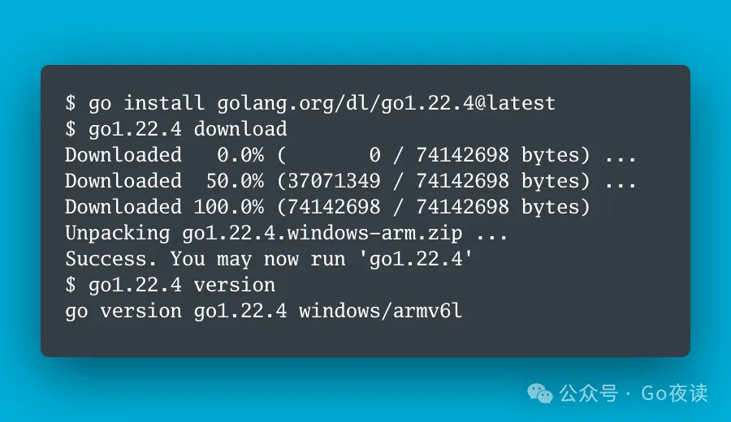

封面图：Go 1.22.4 is Released!

## 🌟 AI 相关

[《开源百B大语言模型哪家强?》](https://mp.weixin.qq.com/s/Jgf9akHdgxEokrlMPmGgQQ)。本文作者爱因总结了截至2024年5月开源社区的百B大模型，包括Mixtral、Llama 3、Qwen1.5-110B 和 DeepSeek-V2。每个模型都有其特点，例如Mixtral 8x22B 采用稀疏的专家混合（SMoE）结构，性能强劲且成本效益高；Llama 3 400B 在多模态和多语言能力上有显著提升；Qwen1.5-110B 支持长达32K token的上下文长度，并在多语言理解方面表现优秀；而DeepSeek-V2 通过多头潜在注意力（MLA）和DeepSeekMoE的创新架构，实现了更高的性能和效率。文章详细对比了这些模型的架构、训练数据和性能表现，为读者提供了深入的参考。

[《你好，Qwen2!》](https://mp.weixin.qq.com/s/s5vChAY6B2s_ZVK-ALYP2w)。本文介绍了全新的Qwen2系列模型，这是通义千问团队对Qwen1.5的重大升级，包括从0.5B到72B的五个尺寸的预训练和微调模型。Qwen2不仅增加了27种语言的高质量数据，还在多项基准测试中表现出色，特别是在自然语言理解、代码、数学和多语言能力方面。Qwen2模型还支持最长128K tokens的上下文长度。文章详细阐述了Qwen2的架构、训练数据和优化方法，以及微调、推理和部署的详细过程。此外，Qwen2采用了更加开放的Apache 2.0许可（除72B模型外），以推动其在全球各地的应用。

[《Mobile-Agent-v2: GPT4v + 多Agent提高40%准确率》](https://mp.weixin.qq.com/s/EXFIMUaSJfG_WhRCBzgmKA)。本文介绍了由一支团队开发的Mobile-Agent-v2，这是一个通过多代理协作优化移动设备操作的助手系统，包含规划、决策和反思三个代理。与单一代理架构相比，Mobile-Agent-v2在复杂的移动设备任务中提高了30%以上的任务完成效率，并在一些高级操作中达到了55%的成功率。通过整合视觉感知和记忆模块，该系统大大改善了对屏幕内容的识别和任务执行的精度。反思代理的引入帮助纠正错误操作，进一步提升了系统的可靠性和灵活性。相关代码已在GitHub开源。

[《Karpathy点赞，这份报告教你如何用 LLaMa 3创建高质量网络数据集》](https://mp.weixin.qq.com/s/luZGMG1RRUT4X_ckt8hsCQ)。本文作者总结了一份名为FineWeb-Edu的工作，该工作受到AI大牛Andrej Karpathy的推荐。FineWeb-Edu通过使用LLaMa 3 70B评判，将原始的15万亿个FineWeb token过滤为1.3万亿个高质量教育内容token。FineWeb数据集来自96个CommonCrawl快照，经过多步数据过滤和重复数据删除，形成一个高达15万亿token的预训练数据集。FineWeb-Edu进一步利用LLaMa 3进行精细化的教育内容筛选，在教育基准测试中表现优越。文章深入探讨了大规模数据过滤、教育内容筛选器的设计和评估方法，非常适合研究如何创建用于大语言模型预训练的高质量网络数据集。

[《RLHF替代方案:在SFT以外，我们还能拿SFT数据做什么?》](https://mp.weixin.qq.com/s/duayAuvVfSoMlpRJQbDjrA)。本文提出了一种名为Alignment from Demonstrations (AfD)的RLHF替代方案。通过Inverse RL trajectory matching方法，文章探讨了何时应该使用SFT数据，何时应该进行Reward Modeling，并提出了利用SFT数据进行Reward Modeling的策略。具体内容涵盖MDP的定义、RLHF的局限、逆向强化学习的优缺点，并提供了相关的实验验证结果，展示了AfD方案在多种任务中的有效性。研究中使用的原模型和强化模型效果接近RLHF，具有更高的成本效益。

[《大模型对齐到底是与谁的价值对齐?KAIST-AI | 提出大模型多价值对齐方法!》](https://mp.weixin.qq.com/s/w_MFh_-W5wpV2FwMCP5Yfg)。本文介绍了KAIST-AI团队提出的一种大模型多价值对齐方法。传统的模型对齐方法假设与公众整体价值对齐是最佳选择，但人类价值观多样，需个性化对齐来满足用户多样化的需求。为此，作者创建了一个包含192k种价值观组合和65k条用户指令的偏好数据集，并训练了名为JANUS7B的大模型。实验结果表明用户可通过系统消息表明其价值偏好，使模型生成符合个体价值观的内容，提高了大模型在适应不同用户偏好方面的灵活性和有效性。

[《深入理解AWQ量化技术》](https://mp.weixin.qq.com/s/7tPKmp-Z_unsjl7n7lV89Q)。本文由Coder.AN撰写，介绍了AWQ（Activation-aware Weight Quantization）量化技术，这是一种基于激活值分布挑选显著权重进行量化的方法。AWQ量化不依赖反向传播或重建，可以保持大型语言模型在多领域的泛化能力。AWQ技术已被集成至多个推理框架，并被许多大厂采用，获得Mlsys 2024最佳论文提名。文章详细解释了AWQ的核心观点及其具体实现步骤，包括显著权重的识别和缩放算法的使用，有助于大幅降低模型内存占用并提高推理速度。

[《单卡训练 LLaMA-3-70B?PiSSA 参数微调方法实践》](https://mp.weixin.qq.com/s/o6shuvsz8UFJxbsknKf0tQ)。本文作者孟繁续博士介绍了来自北京大学人工智能研究院的一种名为PiSSA的参数微调方法。PiSSA通过对预训练模型的权重进行奇异值分解，初始化了一个适配器，能够在不完全训练模型的情况下达到近似效果。PiSSA与LoRA架构相似，但具有更快的收敛速度和更小的量化误差，允许在单卡GPU上完成大模型的微调训练。PiSSA已被合并到huggingface/peft项目中，并展示了在LLaMA-3等多种大模型上的优异表现。

[《借着triton inference server聊一下各种batching方法》](https://mp.weixin.qq.com/s/Y-3ZMvn_gZK1u5I6_woq_g)。本文作者介绍了在实际模型部署中如何使用多种batching方法优化模型性能。通过讨论单batch、静态batch、动态batch、连续batch、ragged batching以及自定义batching策略，文章详细说明了每种方法的适用场景和优势。例如，静态batch适合固定的输入shape，而连续batch则在高吞吐量场景中表现优异。文中提及的triton inference server和TensorRT-LLM等技术，展示了如何通过批处理策略提升模型服务的整体性能。

[《多模态LLM!谷歌 | 提出创新架构Zipper:分开训练再「压缩」》](https://mp.weixin.qq.com/s/OfA333WDUkNIprfMBJ9FjQ)。本文作者介绍了Google DeepMind提出的新型多模态架构Zipper。Zipper由多个单模态预训练解码器组成，通过交叉注意力将这些解码器压缩在一起，利用有限的跨模态数据微调，实现多模态生成能力。该方法利用无监督单模态数据进行强大的单模态预训练，然后通过融合这些预训练解码器来生成多模态内容。实验表明，Zipper模型在语音到文本和文本到语音任务上表现出色，并且相比传统方法更高效地利用了对齐数据。

[《2024 人工智能最前沿:分享几个大模型(LLMs)的热门研究方向》](https://mp.weixin.qq.com/s/4kwCqxu6e2uFZ53UGbtDuw)。本文作者介绍了当前人工智能领域中几个热门的大模型（LLMs）研究方向，包括检索增强生成（RAG）、大模型Agent、Mamba、MoE和LoRA等。每个方向都有其独特的应用场景和技术创新，例如RAG结合信息检索和文本生成以提高内容的准确性和鲁棒性，大模型Agent通过多任务学习和常识推理来增强AI的适应性，并且LoRA通过参数高效微调技术在减少资源消耗的同时维持模型性能。文章详细介绍了这些方向的研究重点和面临的挑战，旨在帮助寻找研究方向的学者了解前沿动态。

## ⭐️ Go & 云原生 & Rust 相关

[Rust tips #41 ~ #60](https://mp.weixin.qq.com/s/92jjgtbPJ0W6pcgudfkq2A)

[全球最大开源项目之一——Kubernetes诞生十周年](https://mp.weixin.qq.com/s/7bma0aoB2ZLX5F_LmvG19w)

[Rust Tips #21 ~ #40](https://mp.weixin.qq.com/s/buOZUGUF6bKoN3J3dOcZ4A)

[聊一聊使用Rust进行Web开发的细节](https://mp.weixin.qq.com/s/kDxIJEy9kfvvRXEZCzVI7Q)

[Rust 中使用 Serde 和 Serde_json 库实现 JSON 操作](https://mp.weixin.qq.com/s/RM6AzkFPBMUxWPe2Z3Ot3w)

[使用 Rust Actix 快速开发高性能的Web应用](https://mp.weixin.qq.com/s/sJazQAYon7dgYRYIaLhj5g)

[Rust Actix-Web 高性能HTTP服务器的实现与配置](https://mp.weixin.qq.com/s/sJUpIAxBMxbxXFmZu673ZA)

[在 Rust Actix-Web 项目中实现 SSE 实时推送功能](https://mp.weixin.qq.com/s/4MwfLHqxFXkSxT6ytWr_lw)

[Rust Actix-web 错误处理的最佳实践](https://mp.weixin.qq.com/s/FqkbhsN93hDgsUvDrhKniA)

[快速上手Rust Actix-Web中的单元测试和集成测试](https://mp.weixin.qq.com/s/si0VzcyZRIp9cX-22ukLUA)

[Rust 开发到底用 RustRover 与还是 VS Code Rust 插件](https://mp.weixin.qq.com/s/sFCkv1f6qtfsHEbc-wD5pg)

[深入理解Rust的线程安全机制](https://mp.weixin.qq.com/s/FiO0c0CDJ4LR2GsRdh8CxQ)

[跟着 Google 团队快速入门 Rust 编程](https://mp.weixin.qq.com/s/3z9lbJXKsKmYOUNZLFnCtw)

[Gopher的Rust第一课：Rust代码组织](https://mp.weixin.qq.com/s/3Xo6meiZa_AitddFpgUSZw)

[Go 项目文件命名规范是什么](https://mp.weixin.qq.com/s/ai54GIM-e3hWNj1MMUbntA)

[Rust Tips #1 ~#20](https://mp.weixin.qq.com/s/8r_8k6mN54obPSs1lUkz6Q)

[如何优雅地处理 Goroutines 中的错误](https://mp.weixin.qq.com/s/tzUzoyAaNq-59PbwBlvqdg)

[Go 1.22.4 is Released!](https://mp.weixin.qq.com/s/4VwlsxZ17kcZjOgPl-Ahtw)

[Go 语言 mongox 库：简化操作、安全、高效、可扩展、BSON 构建](https://mp.weixin.qq.com/s/Y7Cl_vKTN4CUcemmE5a17A)

[Golang：使用bcrypt实现密码加密和和校验](https://mp.weixin.qq.com/s/4pO7yMSiwXhTTU7IM1TusQ)

[Go 夜读第 154 期：木鸟带你建立理解分布式系统的框架](https://mp.weixin.qq.com/s/7dD18BazBSRdkaGXNF-toA)

[K8s集群稳定性提升手段](https://mp.weixin.qq.com/s/ShzYKGkOAqJFE1qRQXjSxw)

[Crossplane 实战：构建统一的云原生控制平面](https://mp.weixin.qq.com/s/O5M5RFq2pgEutYncFYsFNA)

[如何用 golang 从 OpenAI, Ollama 和 Claude 获取可靠的结构化输出](https://mp.weixin.qq.com/s/h8qaz1LF7HdwRy6ottW8cg)

[Go 还缺少什么，能更完美](https://mp.weixin.qq.com/s/gMro9EomjDnflLKldzZuag)

[命令分发模式](https://mp.weixin.qq.com/s/3E2UvCIx9_XpLbmBmu-yUg)

[Enhancing Kubernetes API with k8s.io/apiserver - 自定义APIServer篇](https://mp.weixin.qq.com/s/raFDnbkWU4G8Mvng1yo_8g)

## 📒 后端相关

[“鸭子数据库”DuckDB正式发布1.0稳定版：C++引擎代码超30万行、百万级月下载量](https://mp.weixin.qq.com/s/HIsTtf7QC_n82fV6JuYv7g)

[干货 | 携程数据基础平台2.0建设，多机房架构下的演进](https://mp.weixin.qq.com/s/7TxBtoz4wMCjYjFe3qfKxg)

[封装优雅的缓存组件库（Redis 缓存与内存缓存）](https://mp.weixin.qq.com/s/yQLKQE5EB7fDBPAXzLPpEw)

[MySQL 深潜 - Semijoin 丛林小道全览](https://mp.weixin.qq.com/s/UYS5ALDC0nOdookJGijkrg)

## 📒 前端相关

[61儿童节，我给儿子做了两款coze小应用，让他见识一下程序员爸爸的厉害](https://mp.weixin.qq.com/s/YxPxpds9OJl0CWXTCYfxWg)

[忆童年：用 Coze 搭一只「AI 电子宠物」](https://mp.weixin.qq.com/s/0oZaNQguFHHL3OiXoiGbvA)

[聊下 Mako 的 Benchmark](https://mp.weixin.qq.com/s/b7VpQ5LNKYYKf40Rq5youg)

[MDH Weekly 127 – 《六一快乐》](https://mp.weixin.qq.com/s/8T9pfdKQ5A9N5e87Y92h5g)
