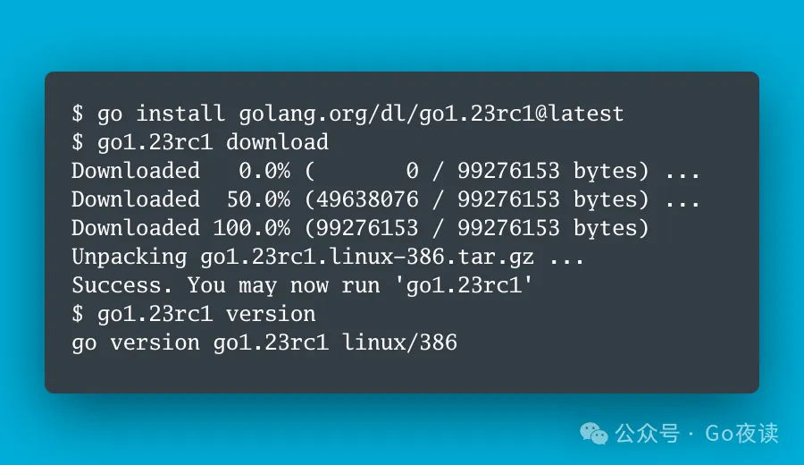

封面图：Go 1.23 rc1 已发布，包括极具争议的迭代器

## 🌟 AI 相关

:::tip 技术资讯

- [OpenAI is training a new model CriticGPT, to catch bugs in GPT-4’s code and to reduce hallucinations](https://twitter.com/rohanpaul_ai/status/1806501254937313407)
- [New 4 hour (lol) video lecture on YouTube: "Let’s reproduce GPT-2 (124M)"](https://twitter.com/karpathy/status/1799949853289804266)
- [OmniParse：可将任何非结构化数据提取/解析为针对 LLM 应用优化的结构化、可操作数据](https://twitter.com/shao__meng/status/1806479762975752352)
- [DB-GPT: 构建生产级别的 AI Native Agent 应用！⚡️🔥蚂蚁开源首个 GraphRAG 框架！支持图可视化和详细示例代码！](https://twitter.com/tuturetom/status/1806312637883703331)
- [自动化数据标注更进一步！Human in the Loop 🥳 OpenAI 发布新模型 CriticGPT「LLM 评论家」并公布论文⚡️](https://twitter.com/tuturetom/status/1806507828791939098)
- [Announcing Meta LLM Compiler: a family of models built on Meta Code Llama with additional code optimization and compiler capabilities](https://twitter.com/AIatMeta/status/1806361623831171318)
- [Announcing llama-agents： a framework for turning your set of agent functions into microservices that can communicate via an API interface](https://twitter.com/jerryjliu0/status/1806353914125861376)
- [力压 Llama3！最强开源模型来了！😆就在刚刚！Google I/O 柏林宣布开源 Gemma2！🔥9B/27B模型](https://twitter.com/tuturetom/status/1806360256857211364)
- 这个 prompt 确实不错：“用逐渐增加复杂度的方式解释 XXX”
- [Meta推出了Meta LLM 编译器（Meta Large Language Model Compiler）](https://twitter.com/aigclink/status/1806493149763932275)
- [深度剖析字节豆包 AI](https://twitter.com/hongming731/status/1805941651405479970)
- [Very powerful prompt: "Explain it with gradually increasing complexity."](https://twitter.com/rohanpaul_ai/status/1806100957710991670)
- [Find all the awesome LLM Apps demo with RAG in the following Github Repo](https://twitter.com/Saboo_Shubham_/status/1805789990431211686)
- [发现一个很不错的 AI 学习网站 Emergent Mind，通过抓取 arXiv 上 AI 最新研究论文，再用 GPT 去总结，通过分类、趋势流行度、时间来筛选，很适合学术研究，需静下心来看看](https://twitter.com/HiTw93/status/1806113714522804259)
- [A great dataset just arrived in @huggingface](https://twitter.com/rohanpaul_ai/status/1806100283853779166)
- [You can do A MASSIVE cost saving (up to 10x)💰 and Boost Speed by upto 100x ⚡ for your OpenAI/HuggingFace Hub/Bard/Anthropic API calls by using caching with GPTCache library](https://twitter.com/rohanpaul_ai/status/1805896032602997201)
- [一键「代码可视化」辅助工具设计](https://twitter.com/eviljer/status/1805902754239656141)
- [Claude官方给的这个提示库非常好，包含了从生成电子表格、创建网站到会议记录、分析推文等多种类型的高品质提示词等](https://twitter.com/aigclink/status/1805827636272546123)
- [系统设计入门 @donne_martin 262k✨](https://twitter.com/shao__meng/status/1805397985498644972)
- [Building Optimized RAG with LlamaIndex + DSPy](https://twitter.com/llama_index/status/1805622494130586078)
- [RAG 十二个痛点和解决方案](https://twitter.com/shao__meng/status/1805601464922128536)
- [看到一个全栈 DS / DA 数据分析岗位养成手册，来自一名哥大数据科学的学生 Jace 整理的，很适合数据分析科学入门学习使用，结合了不少国内的案例来分析学习](https://twitter.com/HiTw93/status/1805743777128013841)
- [🔮 手搓 Figma 插件，接入 #Gemini Vision](https://twitter.com/eviljer/status/1805270212025209140)
- [假如你在有意识的去学理财，这个 TradingView 会很好用，特别对于买股票的小伙伴，可以很清楚看到世界股票的排名以及各种维度的分析，比如这个「按市值计算的全球最大公司排名」，我经常用它来分析一些关注的股票很好用，从一些科学维度来看是否该买这支](https://twitter.com/HiTw93/status/1805386673968365669)
- [🤗🤗 @huggingface Community-led Computer Vision Course](https://twitter.com/snehilsanyal/status/1804750939519357028)
- [Claude 3.5 Sonnet's coding skills and the Artifacts are just insane. 👨‍🔧 ](https://twitter.com/rohanpaul_ai/status/1804932544263012793)
- [GPT-4 中做思维导图，一些可行的方法参考](https://twitter.com/eviljer/status/1804837427468779879)

:::

- [2024稀土开发者大会精彩亮点|代码不止 掘金不停](https://mp.weixin.qq.com/s/BesgaZ-Dj0DosZks1mvuRg)
  - 本文作者介绍了在2024稀土开发者大会上，五位技术嘉宾分享了开源生态、新技术发现及应对技术变革的策略，探讨了AI在多媒体内容生成、教育等领域的应用，以及如何通过开放生态系统推动企业人工智能的发展。
  - 演讲嘉宾还讨论了生成式AI对现实世界的影响、AI编程工具的未来发展方向、大模型部署成本降低策略，以及Mistral模型的发展和应用，强调了评估在生成式AI开发过程中的重要性，并探讨了AI基础设施的优化策略。

- [Semantic Kernel:微软开源的 LangChain 替代](https://mp.weixin.qq.com/s/ZJTfCkWOrE8omRZEhrj_3g)
  - 本文作者介绍了微软开源的Semantic Kernel，这是一个轻量级的开源软件开发工具包（SDK），旨在帮助开发者将AI功能集成到应用程序中。它提供了灵活的插件架构、AI驱动的插件编排和多语言支持（C#、Python和Java）。
  - 文章详细比较了Semantic Kernel与LangChain的特点和优势，强调了Semantic Kernel在企业级功能、安全性、模块化和自动化业务流程方面的优势，适合构建需要与现有系统集成的企业级AI应用程序。

- [陈丹琦团队图表解读新基准:新王Claude3.5刚及格，但已是模型最强推理表现](https://mp.weixin.qq.com/s/Me2PCh_-WUwaZK4s3oK-OA)
  - 本文作者陈丹琦团队提出了新的图表任务测试基准CharXiv，涵盖2323张来自arXiv论文的真实图表，旨在更好地评估多模态大模型的图表推理能力。与以往的数据集相比，CharXiv难度更大，问题类型更广泛。
  - 研究发现，尽管Claude 3.5 Sonnet在推理任务中表现最好，但也仅仅及格，整体模型在推理问题上的表现仍不理想。描述能力强的模型通常推理能力也强，但反之不一定成立。

- [谷歌开源系模型第二代免费开放!27B媲美LLaMA3 70B，单H100或TPU主机可跑](https://mp.weixin.qq.com/s/YtPPIc73rNAiPu-OyMFTYg)
  - 本文作者介绍了谷歌开源的Gemma 2模型，该模型在27B参数规模下提供了与LLaMA3 70B相媲美的性能，并且可以在单个NVIDIA H100或TPU主机上运行。Gemma 2还包括一个更轻的9B版本，性能同样出色。
  - Gemma 2采用了Gemini同款技术架构，具有更高的推理效率和安全性。其关键特点包括交替使用局部滑动窗口注意力和全局注意力机制，以及分组查询注意力（GQA）。此外，谷歌计划在下个月通过Google Cloud的Vertex AI平台提供Gemma 2的部署和管理服务。

- [别再被大模型骗了，一个小技巧，让LLaMa3诚信度提升65%](https://mp.weixin.qq.com/s/mS-NhSAb2-T3Ti14HepDAA)
  - 本文介绍了华中科技大学团队提出的新框架，通过理论和实践提升大语言模型的诚实性和有益性。他们构建了HoneSet数据集，并设计了针对开源和商业模型的优化方法。实验表明，经过两阶段微调后，LLaMa3的诚信度提升了65%。
  - 研究重点在于通过提示优化和两阶段微调，使模型在面对不同类型问题时更诚实可靠。该方法在包括GPT-4、ChatGPT和Claude等多个主流模型上均取得了显著成效，展示了其广泛适用性。

- [RAG、ROG、RCG傻傻分不清?概念辨识及RCG在SimplyRetrieve中的naive实现](https://mp.weixin.qq.com/s/KxaiKjrsMyy8kh7Sju2oJg)
  - 本文介绍了RAG（检索增强型生成）、ROG（检索关闭型生成）和RCG（检索中心型生成）的概念及其区别。RAG结合外部数据和模型内在知识，ROG完全依赖模型内在知识，而RCG强调上下文解释与知识记忆的分离，通过检索器提供知识，语言模型负责解释。
  - 文章还讨论了RCG在SimplyRetrieve中的实现，指出尽管RCG方法被认为更清晰和有效，但在实际应用中通过提示词进行简单区分的方法仍存在可行性和泛化性的问题。RCG的实现难点在于明确区分语言模型和检索器的角色。

- [Bengio团队提出多模态新基准，直指Claude 3.5和GPT-4o弱点](https://mp.weixin.qq.com/s/Zy-kM3bvN-1oHondw1VLzw)
  - 本文作者张天宇介绍了由图灵奖得主Yoshua Bengio团队提出的新视觉问答任务“视觉字幕恢复（VCR）”，该任务旨在评估视觉语言模型（VLM）的推理能力。研究表明，现有模型在处理复杂推理任务时仍存在显著差距，尤其是在被遮挡文字的恢复上，模型表现远不及人类。
  - 通过构建VCR数据集，研究团队发现大多数模型无法有效利用图像信息来提升准确率，特别是在困难难度下，模型的表现极差。该任务揭示了模型在图像和文本对齐方面的局限性，并为未来多模态模型的训练和评测提供了新的方向。

- [Multi-Head RAG:多头注意力的激活层作为嵌入进行文档检索](https://mp.weixin.qq.com/s/OQiRDhRMzwRdF-GHi8-egQ)
  - 本文由黄继彦介绍了一种新的多头RAG (MRAG)方案，通过利用Transformer模型中的多头注意力层激活，而非传统的前馈层激活来进行文档检索。MRAG能够在不增加存储需求的情况下，捕获数据的多面性，显著提高文档检索的相关性和准确性。
  - 实验结果表明，MRAG在检索成功率上比标准RAG提高了10-20%，并且在实际应用中，如法律文件合成和工业事故原因分析中，也展示了其优越性。MRAG通过综合评估和实际用例证明了其有效性和广泛适用性。

- [DCGen:一种新的Design-to-Code框架，设计稿转代码有效性提高](https://mp.weixin.qq.com/s/Q4NljU7V9YSfiyycF8s74Q)
  - 本文作者张天宇介绍了DCGen，一个基于分而治之策略的Design-to-Code框架，通过将复杂的设计稿拆分为更小的视觉单元，再利用多模态大模型（MLLM）生成每个单元的代码，最后整合成完整代码。DCGen有效提升了设计稿转代码的准确性和视觉相似性。
  - 实验表明，DCGen在视觉相似性和代码相似性方面比传统方法提升了14%，特别是在处理复杂网页设计时表现尤为出色。DCGen的创新在于其分割和组装阶段的递归处理方法，使其在多种复杂度的网站中均表现优异。

- [Google 发布最新开放大语言模型 Gemma 2，现已登陆 Hugging Face Hub](https://mp.weixin.qq.com/s/5UHSKB_V5Cdtl4jrWE1aQw)
  - 本文由机器之心发布，介绍了Google最新发布的开放大语言模型Gemma 2。该模型有两种规模：90亿参数和270亿参数，分别有基础（预训练）和指令调优版本。Gemma 2基于Google DeepMind的Gemini，拥有8K Tokens的上下文长度，并在Hugging Face Hub上提供四个开源模型。
  - Gemma 2在滑动窗口注意力、Logit软上限、知识蒸馏和模型合并方面进行了技术创新。实验结果显示，Gemma 2在多个基准测试中表现优异，特别是在长上下文情况下生成质量显著提高。用户可以在Hugging Chat上体验Gemma 2，并通过Hugging Face Transformers集成进行使用。

- [DB-GPT:蚂蚁开源的Text-to-SQL利器](https://mp.weixin.qq.com/s/tP1iLkI5-tcUwmtUqelBKQ)
  - 本文由蚂蚁集团介绍了DB-GPT，一个AI原生数据应用开发框架。DB-GPT通过自然语言交互，实现对数据库的高效查询和数据分析，支持多种数据源和大语言模型，并提供私有化部署和数据脱敏功能，确保数据安全。
  - DB-GPT的核心特性包括私域问答、数据处理与RAG、向量存储与检索、多源数据连接、生成式商业智能、多模型管理与自动化微调、数据驱动的智能体与插件扩展等，适用于企业内部知识库问答、产品文档智能客服、市场分析、用户画像分析等多种应用场景。

- [吴恩达:从 Agent 到 Agentic，超越基础模型的下一代 AI](https://mp.weixin.qq.com/s/Gl74YZn4ylxSHAkwUFB-FA)
  - 本文由子非AI发布，介绍了吴恩达在2024年Snowflake峰会上的演讲，探讨了Agentic AI的概念及其潜力。Agentic AI不同于传统的被动AI系统，它赋予AI主动思考、规划和执行任务的能力，通过代理型工作流程（Agentic workflow）来提升AI系统的性能。
  - 吴恩达强调，Agentic AI可以在复杂任务中分解步骤并通过迭代优化结果，展现出比下一代基础模型更大的潜力。实验表明，即使是较弱的模型在采用Agentic workflow后也能超越更强的模型，展示了Agentic AI在代码生成和视觉任务等领域的广泛应用前景。

- [Florence-2:微软开源的轻量级视觉基础模型，吊打巨型模型!](https://mp.weixin.qq.com/s/VSx4RlyrLYbdDp3IuUF6Cw)
  - 本文由子非AI撰写，介绍了微软开源的轻量级视觉基础模型Florence-2。Florence-2包含两个模型：Florence-2-base（2.3亿参数）和Florence-2-large（7.7亿参数），尽管参数规模较小，但在字幕生成、目标检测、定位和分割等多个视觉任务中表现出色，甚至超越了规模更大的模型。
  - Florence-2采用多任务学习方法，使用大量高质量的视觉标注进行训练，解决了数据有限和缺乏统一架构的挑战。其核心优势包括轻量级架构、强大功能和统一表示。训练数据集FLD-5B包含1.26亿张图像和54亿个标注，支持多任务学习和数据驱动的智能体扩展。

- 🌟 [LLM推理引擎性能评测:vllm、lmdeploy、tensorrt-llm 请应战!](https://mp.weixin.qq.com/s/SIL1Xx_GxJOpp26k7p-VUg)
  - 本文由魔搭社区撰写，评测了三种LLM推理引擎：vllm、lmdeploy和tensorrt-llm。在单并发和多并发情况下，对不同模型和数据集的性能进行了详细对比。评测指标包括吞吐量（Throughput）、首包延迟（TTFT）、每个输出token的时间和整体请求延迟等。
  - 结果显示，vllm在首包延迟方面表现最好，适合少量用户的高体验需求；lmdeploy在吞吐量上优势明显，适合大规模用户服务；tensorrt-llm尽管需要较高的使用成本，但在特定场景下也有其优势。文章还介绍了使用EvalScope工具进行性能压测的方法。

- [Hugging Face Accelerate 两个后端的故事:FSDP 与 DeepSpeed](https://mp.weixin.qq.com/s/hmIvSsZ2-yKEeiXUNRlTQw)
  - 本文由Matrix Yao翻译，介绍了Hugging Face Accelerate对DeepSpeed和PyTorch FSDP两种零冗余优化器（ZeRO）算法的集成及其差异。通过实验，作者发现DeepSpeed在损失函数收敛性方面表现更好，而FSDP需要根据GPU数量调整学习率才能达到预期效果。
  - 文章还讨论了两种算法在混合精度训练中的处理方式，指出DeepSpeed强制将主权重保持为fp32精度，而FSDP提供了更大的灵活性。最后，作者通过吞吐量测试对比了两者在实际应用中的表现，并提供了相关的概念指南帮助用户在两者之间迁移。

- [独家 | 进阶RAG-提升RAG效果](https://mp.weixin.qq.com/s/ics2qC5sZe7W0T1TSnlXTw)
  - 本文由黄继彦编辑，讨论了如何优化RAG（Retrieval-Augmented Generation）管道的各个部分，以提升整体性能。文章详细介绍了从Pre-Retrieval、Retrieval到Post-Retrieval的各项优化技术，包括数据清洗、添加元数据、优化索引结构、分块优化、查询重写和微调嵌入模型等。
  - 通过这些优化技术，RAG系统可以在生成更加准确和高效的回答时，显著提高检索的相关性和响应速度。这些技术适用于各种复杂查询和信息需求，确保系统在生产环境中的高效应用。

- [最新决议，老黄涨薪60%!英伟达股东大会通过，可老黄在偷偷卖股票](https://mp.weixin.qq.com/s/a5jrweBfkDT64prIGCLBOg)
  - 本文由奶茶编辑，报道了英伟达在最新股东大会上通过了CEO黄仁勋薪酬上涨60%的决议，2024财年的总薪酬将达到3416.8万美元。文章还指出，尽管薪酬上涨，黄仁勋近期却在持续出售自己持有的股票，引发了外界的诸多猜测。
  - 文章详细记录了黄仁勋在股东大会上的发言，讨论了英伟达在自动驾驶、加速计算和生成式人工智能等领域的领先地位，并强调了英伟达对未来计算技术和工业革命的影响。同时，文章也提到英伟达在医疗保健、汽车和数字制造等行业的多元化战略。

- [一文梳理有效提升RAG效果的方法](https://mp.weixin.qq.com/s/HrZB4qNga69ePxJvcRiHTA)
  - 本文由黄继彦编辑，梳理了提升RAG（Retrieval-Augmented Generation）效果的方法，首先介绍了几篇关于RAG优化的论文，包括RAPTOR、Self-RAG、CRAG和Dense X Retrieval等。这些方法通过改进检索和生成过程，提高了RAG系统的准确性和可靠性。
  - 文章还记录了一些RAG工程实践经验，如文本切割优化、查询重写和混合检索策略等。这些技术帮助RAG系统在处理复杂查询和信息需求时，提高检索的相关性和响应速度，确保系统在生产环境中的高效应用。

- [五个维度，详解LLM-based Agent中的规划(planning)能力](https://mp.weixin.qq.com/s/O78XDeG2uQARYAUEh4VbvQ)
  - 本文由黄继彦编辑，详细梳理了LLM-based Agent中的规划能力，分为任务分解、规划选择、外部辅助规划、反馈和改进、记忆五个维度。每个维度都探讨了相关的研究工作和实践经验，如任务分解方法中的HuggingGPT和Chain-of-Thought (CoT)等。
  - 文章还讨论了这些方法的优缺点及面临的挑战，包括LLM在复杂任务中的幻觉问题、生成计划的可行性及效率问题等。未来方向包括多模态环境反馈和细粒度评估，以提高LLM在实际应用中的规划能力。

- [更难、更好、更快、更强:LLM Leaderboard v2 现已发布](https://mp.weixin.qq.com/s/SW62l1J92xzo108-jCe9pQ)
  - 本文由RLHF团队撰写，介绍了Open LLM Leaderboard v2的发布背景及其改进。新版本通过更具挑战性的基准测试，如MMLU-Pro、GPQA和MuSR，解决了现有基准测试过度使用和数据污染的问题，以更好地评估大语言模型（LLMs）的实际性能。
  - 文章还介绍了排行榜的新功能，包括使用标准化得分报告更公平的排名、更新评估套件以确保可复现性，以及引入社区投票系统和维护者推荐，帮助用户找到最有用和高质量的模型。新排行榜旨在推动开放和可复现的模型评估，促进LLM领域的持续进步。

- [迪士尼笑了!陈丹琦团队最新研究，打造AI"版权护盾"，AI创新不侵权](https://mp.weixin.qq.com/s/pxQzCUys3tJfRHVzIjbHsA)
  - 本文由陈丹琦团队撰写，介绍了普林斯顿大学计算机科学系助理教授陈丹琦及其团队开发的新方法，结合提示词重写技术与负面提示词策略，旨在生成过程中规避使用受保护的内容，既保障了创新，又尊重了知识产权，堪称AI领域的"版权护盾"。
  - 文章还阐述了COPYCAT评估套件的使用，通过对多个主流AI模型进行测试，验证了新方法在降低生成版权角色图像风险方面的有效性，并提出了未来在保护知识产权与发挥AI创造力之间寻求平衡的可能性。

- [耳朵没错，是声音太真了，字节豆包语音合成成果Seed-TTS技术揭秘](https://mp.weixin.qq.com/s/pAB_ezlEmUCM98n1eQX0ZQ)
  - 本文由字节跳动豆包大模型团队撰写，介绍了其最新发布的语音生成大模型Seed-TTS。该模型能够生成几乎与真人无异的语音，包括发音瑕疵，且在模仿人类说话方面表现出色。Seed-TTS通过文本生成全新语音，并能复刻原素材的声音特征。
  - 文章详细阐述了Seed-TTS在生成细节、自然度和稳定性上的技术挑战和解决方案，以及其在数据覆盖、模型设计和工程方面的创新。Seed-TTS的发布标志着语音生成技术的新高度，应用场景广泛，未来潜力巨大。

- 🌟 [我做了一个 AI 搜索引擎](https://mp.weixin.qq.com/s/25eXZi1QgGYIPpXeDzkQrg)
  - 本文由ThinkAny团队撰写，介绍了他们开发的AI搜索引擎ThinkAny。文章详细描述了ThinkAny的技术架构、发展历程及其在全球市场的冷启动成功经验。ThinkAny利用RAG（检索增强生成）技术，结合多语言支持和高效的AI回答功能，目标是实现更快、更准的搜索体验。
  - 文章还探讨了AI搜索引擎的核心要素，如准确度、响应速度和高可用性，并介绍了ThinkAny在多模式使用、多模型对话和多模态检索等方面的创新功能。作者分享了对AI搜索市场的看法，认为准确度和平台化是未来发展的关键，并强调了成本优化和差异化创新的重要性。

- [大模型综述:万字长文详解AI大模型的原理、应用与未来趋势](https://mp.weixin.qq.com/s/uQ_MQwAo5FbVsaGSGKzaQA)
  - 本文由AI领域专家撰写，详细介绍了大语言模型（LLMs）的发展历程、独特魅力及其在现实世界中的多彩应用。文章回顾了从统计语言模型到神经语言模型再到预训练语言模型的演进过程，强调了LLMs在上下文理解、少样本学习、多模态融合、推理和问题解决以及持续学习和适应方面的强大能力。
  - 文章还探讨了LLMs在日常生活、工作场景、教育、创意写作和商业世界中的应用，展示了其在智能手机输入法、编程助手、AI助教、创意写作辅助和客户服务等方面的广泛应用前景。通过实际案例和代码示例，文章生动展示了LLMs在各领域带来的革命性变革。

- 🌟 [Qwen2大模型微调入门实战-命名实体识别(NER)任务](https://mp.weixin.qq.com/s/Cj39J18hXOAkIzHd7HAjXw)
  - 本文由通义千问团队撰写，介绍了如何使用阿里云通义实验室研发的Qwen2大语言模型进行命名实体识别（NER）任务的指令微调。文章详细描述了指令微调的概念及其在提升模型理解和执行特定指令能力方面的作用，并通过实际案例展示了微调后的模型在NER任务中的应用。
  - 文章提供了从环境安装、数据准备、模型加载到训练过程的详细步骤，并介绍了如何使用SwanLab工具监控训练过程和评估模型效果。通过LoRA方法训练，Qwen2-1.5B模型能够在显存需求较低的情况下实现高精度的NER任务，展示了大模型在实际NLP应用中的强大能力和广泛前景。

- [CodeRAG-Bench:RAG遇到了Coder，哪个模型在RAG的加持下最会写代码?](https://mp.weixin.qq.com/s/V4Mg1e4I6aHsF_D9-rrQBQ)
  - 本文由AI研究团队撰写，介绍了CodeRAG-Bench评估基准，用于检验检索增强生成（RAG）技术在代码生成任务中的效果。文章详细描述了CodeRAG-Bench的构建流程，包括编程问题分类、检索资料收集、标注标准文档和设置评估流程，并测试了多个顶尖代码生成模型在不同任务中的表现。
  - 文章探讨了高质量上下文对代码生成的显著提升作用，但也指出了当前检索器和生成器在处理复杂上下文和整合信息方面的不足。研究发现，尽管RAG技术能提升代码生成的准确性，但仍需优化检索系统和模型处理上下文的能力，以实现更高效的代码生成。

- [开源模型破局OpenAI服务限制，15分钟灵活搭建RAG和Agent应用](https://mp.weixin.qq.com/s/a0EETNnbWBEzXJBaLJ_zAA)
  - 本文由AI实验团队撰写，介绍了如何在15分钟内利用开源模型替代OpenAI服务，灵活搭建RAG和Agent应用。文章通过两个实验展示了Qwen2与Ollama、LlamaIndex及LangChain的结合应用，详细描述了从环境安装、模型下载、配置文件创建到代码运行的全过程。
  - 实验一展示了如何使用Qwen2与LlamaIndex实现RAG应用，实验二则展示了Qwen2与LangChain结合实现Agent应用。文章强调了在本地设备上快速部署和运行开源模型的便捷性，提供了详细的代码示例和步骤说明，帮助读者快速上手并实现相应功能。

- [7月9日生效!OpenAI将封杀不支持地区API，违规者将面临封号!](https://mp.weixin.qq.com/s/0Cv7adCioN9ZT8OaL6ifTg)
  - 本文介绍了OpenAI将于7月9日开始封锁不支持地区的API访问，违规者将面临封号。文章指出，OpenAI检测用户使用其API的地区，并警告不支持位置的用户即将封禁“非法”流量。这一举措将导致部分开发者需要更换工具，一些“套壳”应用也会因此暴露。
  - 此外，文章提到OpenAI在新版本的ChatGPT iOS应用中增加了高级语音模式选项，并开始alpha版本的灰度测试。该语音模式具备实时响应自然对话、感知用户情绪和视频聊天等功能，Plus用户将很快获得GPT-4o的完整版功能。

- [语言≠思维，大模型学不了推理:一篇Nature让AI社区炸锅了](https://mp.weixin.qq.com/s/BgMNITn5e1RGUOHQLKv7yg)
  - 这篇由麻省理工学院等机构发表在《自然》杂志上的文章指出，人类大脑生成和解析语言的神经网络并不负责形式化推理，语言主要是用于交流的工具，而不是思考的工具。文章通过神经科学和相关学科的最新证据，挑战了语言对于复杂思维的必要性。
  - 文章引发了科技领域的广泛讨论，特别是在AI社区。研究表明，即使没有语言能力，人类仍然能够进行复杂的思维和推理。文章讨论了语言网络的特性及其在思维和认知中的作用，强调了语言和推理的平行发展而非依赖关系。

- [Skywork AI | 提出新框架:Q*，旨在解决大模型多步推理(Multi-step)错误问题](https://mp.weixin.qq.com/s/dDaYBhewnc9-GslzS7vv1A)
  - 本文作者提出了一个名为Q\*的新框架，旨在解决大模型在多步推理中出现的错误、幻觉和不一致陈述等问题。Q\*通过学习一个Q值模型作为启发式函数，引导LLMs选择最合适的下一步行动，无需对每个任务进行微调，从而降低计算资源开销并避免灾难性遗忘。
  - Q\*框架在数学推理和代码生成等任务上的表现显著提升，通过深思熟虑的规划，有效帮助模型规避推理过程中的错误和逻辑不一致性。实验结果表明，Q\*在多个数据集上均取得了优异的结果。

- [Modelscope-Agent 增强RAG能力:(一)多策略召回、多模态召回](https://mp.weixin.qq.com/s/On_fAwP-Gjpl6QD_zXzCnQ)
  - 本文介绍了Modelscope-Agent通过引入llama-index来增强其在多策略和多模态召回场景中的应用能力。作者详细描述了如何通过多策略召回器混用和支持多种模态文件（如文本、图片、音频、视频）的读取和处理，提升了知识库的RAG（检索-生成）能力。
  - 文章还展示了具体的实现方法和代码示例，说明了如何配置和使用这些新功能。通过这些增强措施，Modelscope-Agent能够在不同场景中提供更高的准确率和性能效果，满足复杂多样的应用需求。

- 🌟 [TGI 基准测试](https://mp.weixin.qq.com/s/_fwMZnycmFWHFIxR76FJTg)
  - 本文作者Derek Thomas介绍了TGI基准测试工具，该工具能帮助用户超越简单的吞吐量指标，对TGI进行全面的性能剖析。文章详细讲解了如何利用该工具进行服务性能优化，以便根据实际需求进行调优并作出最佳决策。
  - 文章还展示了如何在Hugging Face空间上使用TGI基准测试工具，通过具体示例和图表说明了延迟与吞吐量的关系，帮助用户理解和优化LLM推理服务的性能。

- [成果｜Seq1F1B：节省50%显存的长文本模型流水线并行训练技术](https://mp.weixin.qq.com/s/MJaWdar-rnYC8YnYyJsBnw)
  - 本文作者介绍了他们与北京邮电大学团队共同开发的Seq1F1B训练技术，这是一种新的长文本模型流水线并行训练方法。Seq1F1B通过将流水线调度单元按序列切分，并提出针对序列维度的1F1B流水线并行策略和高效的序列切分方法，显著降低了流水线对显存的需求，同时减少了因空闲气泡导致的性能损失。
  - 实验结果表明，Seq1F1B相比传统流水线方法可减少50%的显存占用，最高能支持30B GPT-2模型的64k长文本训练（不启用重计算显存优化），并在大多数情况下实现更高的训练吞吐。该技术解决了1F1B流水线在长文本训练中面临的显存瓶颈，为大语言模型的高效训练提供了新的解决方案。

- [Vector | Graph:蚂蚁首个开源Graph RAG框架设计解读](https://mp.weixin.qq.com/s/hd2FzO2p15ERbHe0w87J8Q)
  - 本文作者介绍了蚂蚁集团开发的通用开源RAG框架，该框架旨在兼容多样化的基础研究建设和工程化应用需求。文章详细阐述了从传统RAG到Graph RAG的技术演进，并提出了一个统一的架构设计，可以同时支持向量索引和图索引等多种索引形式。
  - 作者还介绍了蚂蚁的Graph RAG开源技术方案，包括DB-GPT、OpenSPG和TuGraph等核心组件，并探讨了未来的优化方向，如改进内容索引和检索生成阶段，以及RAG向Agent架构的演化趋势。文章强调了Graph RAG作为新兴AI工程领域的潜力，并邀请开发者参与共建。

- 🌟 [[LLM推理优化][万字]TensorRT-LLM部署调优-指北](https://mp.weixin.qq.com/s/b_-O0FoTYtANJbQvks9ghw)
  - 本文作者详细介绍了TensorRT-LLM部署过程中的性能调优技巧。文章涵盖了多个关键方面，包括Batch size相关设置、影响首Token时延的配置、custom_all_reduce的使用、Decode时延的优化、fp8/int8 KV Cache的设置、In-Flight Batching的相关配置以及bls模式的设置等。
  - 作者还提供了如何开启debug模式的指导，并总结了TensorRT-LLM性能分析的方法。这篇文章为TensorRT-LLM的实际应用提供了全面的指导，帮助读者理解和优化LLM推理服务的性能。作者承诺长期更新文章内容，以反映最新的实践经验和遇到的问题。

- [超越Devin!华为等| 解决接近30%的GitHub issues!最强CodeR来啦!](https://mp.weixin.qq.com/s/EOn1pKn7fo4unJm3H1xnQQ)
  - 这篇由华为、中科院、新加坡管理大学和北京大学的研究人员撰写的文章介绍了一个名为CodeR的新框架，用于自动解决GitHub issues。CodeR采用多智能体（Multi-Agent）和预定义的任务图（Task Graph）方法，在SWE-bench-lite数据集上实现了28.33%的issue解决率，创造了新的记录。
  - CodeR框架包含五个代理角色：经理、复现者、故障定位器、编辑器和验证者，每个角色都有特定的动作空间。关键创新在于使用结构化任务图来表示解决issue的计划，这种方法避免了大语言模型在指令遵循和长上下文处理中的问题。此外，CodeR还利用LLM生成的测试用例和现有代码库中的测试来改进故障定位和代码检索。

## ⭐️ Go & 云原生 & Rust 相关

:::tip 技术资讯

- [A simple slog.Handler designed to recursively merge and de-duplicate log attributes, ensuring clean, concise, and informative log entries](https://twitter.com/golangch/status/1806352351017529544)
- [A cloud-native vector database, storage for next-generation AI applications](https://twitter.com/golangch/status/1806703850998333532)
- [A Go library that offers functional programming using generics](https://twitter.com/golangch/status/1806244656998404448)
- [A Go Cookie Library "Cookies, but with structs, for happiness."](https://twitter.com/golangch/status/1806967292846080218)
- [An interesting new Video Tutorial Series about "Build an e-commerce backend in Go"](https://twitter.com/golangch/status/1806193172076273852)
- [Structuring Go Code for CLI Applications: Commonly Used Program Layouts for Robust Applications](https://twitter.com/golangch/status/1805943665388314905)
- [A great article about "How Golang Compiler Works"](https://twitter.com/golangch/status/1805905133294784513)
- [A monitoring software that makes it super-easy to monitor availability and performance of various components of your system](https://twitter.com/golangch/status/1805808975541141839)
- [A fully production-ready solution designed to implement best practices for building performant and secure backend REST API services](https://twitter.com/golangch/status/1805802912947314713)
- [A Go-based CLI generates runbooks with AI or from commands you provide](https://twitter.com/golangch/status/1805481161533124789)
- [An open-source UI-first Identity and Access Management (IAM) / Single-Sign-On (SSO) platform with web UI](https://twitter.com/golangch/status/1805471204465148221)
- [An interesting article "No sleep until we build the ideal pub/sub library in Go"](https://twitter.com/golangch/status/1805440695554994683)
- [A Go web and RPC framework with lots of built-in engineering practices](https://twitter.com/golangch/status/1805227429880906187)
- [CPU vs I/O Bound Benchmarking in Go](https://twitter.com/golangch/status/1805144296812613711)
- [A great article about "How to Implement Two-Factor Authentication (2FA) with TOTP in Golang"](https://twitter.com/golangch/status/1804489580135014535)
- [EntGo vs GORM vs SQLx : Benchmarking Golang ORMs](https://twitter.com/golangch/status/1804879167567057139)

:::

[（九）深入解析 Go 语言 GMP 模型：并发编程的核心机制](https://juejin.cn/post/7384303275376230411)

[（八）Go-Zero 数据库实战：配置、建模与业务逻辑一体化](https://juejin.cn/post/7382470660775624758)

[Golang empty struct 的底层原理和其使用](https://mp.weixin.qq.com/s/yodhtxhjmiIymRHUNIQelw)

[国内多个库被 rsc 钉上 Go 耻辱柱](https://mp.weixin.qq.com/s/tb10VnpdiZCLYhXZDb--kQ)

[Go 如何基于 MVS 解决依赖关系问题](https://mp.weixin.qq.com/s/Ok7QCpo8yhaCFu95Qz0m_Q)

[Ducker：Rust编写的管理Docker容器的终端应用程](https://mp.weixin.qq.com/s/MTTizYTY5vctqhiUia_DsA)

[从使用到原理看Kubernetes网络](https://mp.weixin.qq.com/s/yJunfxNPp0qfFBcdyzOeGA)

[用Go语言从零开始开发一个Prometheus Exporter](https://mp.weixin.qq.com/s/Xs2BCbYKhb0IVe4yra6l-A)

[Go与神经网络：手写数字识别](https://mp.weixin.qq.com/s/tVuV597whmQ03CHeRFA5RQ)

[链路追踪详解（五）：链路传播 Header 详解](https://mp.weixin.qq.com/s/B7WBb-9XDRDOZFZ-DF0xeQ)

[Go 模块使用 GitLab subgroups 的问题](https://mp.weixin.qq.com/s/D_AsV9QpOZ_5v8f1eKoxjQ)

[Go 1.23 rc1 已发布，包括极具争议的迭代器...](https://mp.weixin.qq.com/s/ZjLlwhYoLSDTKtD5kecVYA)

[GORM V2 几个最实用的功能和升级注意事项](https://mp.weixin.qq.com/s/I8PQep7BkB3l7Vz8A6UonQ)

[Rust 编写专为容器而设计的操作系统 Bottlerocket ，已 8.3k+ star！](https://mp.weixin.qq.com/s/bz3RmkoUCrNiGubvhQXimw)

[【译】Rust中的Arc与Mutex](https://mp.weixin.qq.com/s/lfM6o5LKExDS3CAIMus5Ag)

[【译】Rust中的Vec类型](https://mp.weixin.qq.com/s/YJfMC-opOP9e-KzcaNydEw)

[【译】为什么Rust中的BTreeMap没有with_capacity()方法](https://mp.weixin.qq.com/s/AlrgIoxCGGoizQkVqoExsw)

[一文搞懂如何排查 Kubernetes 部署问题](https://mp.weixin.qq.com/s/kAT7x9UXuU7XVKMLYQk_OQ)

[Go必知必会：并发编程的核心channel](https://mp.weixin.qq.com/s/8MyiP0fcU5rAJ1cy8aAY0A)

[Go 1.22 提供的更加强大的 Tracing 能力](https://mp.weixin.qq.com/s/E2-d4AWP5YuUQcPKpUXr9Q)

[使用 Gin 快速开发高性能的 Web 应用](https://mp.weixin.qq.com/s/-L4uS9Hc7hnnTxfSd0F0iw)

[错误检查 errors.Is() 会拖慢5倍执行速度](https://mp.weixin.qq.com/s/zfqf1H8D156wVvb6mN1pvw)

[Golang项目代码组织架构实践](https://mp.weixin.qq.com/s/8wDr82Nevb4ZZWkewlBACA)

[C++ vs Rust vs Go 性能比较](https://mp.weixin.qq.com/s/JTcUUrn78DPqNp3BcgLrVg)

[Go 在结构体中定义下划线（_）字段原来还有这个特殊用途](https://mp.weixin.qq.com/s/0wSOnDVW6qwP0wYbjeYqLA)

[Go 高性能本地缓存库 bigcache 是怎么实现的](https://mp.weixin.qq.com/s/ibDaxoTn6Vd5x2d1nq08IQ)

[Go 1.23中的自定义迭代器与iter包](https://mp.weixin.qq.com/s/vN8hNQ1bDKcrq4AlmaIZYA)

## 📒 后端相关

[构建属于自己的云游戏服务器](https://mp.weixin.qq.com/s/7WnJrDtZKYfgMIrFALbJ6Q)

[真好，Navicat Premium 也放出了免费版，终于可以光明正大的用了](https://mp.weixin.qq.com/s/OQcaNRWHB1CBojkObeCLbw)

[漫谈分布式开篇：从全景视野详解单体到分布式架构的蜕变之旅！](https://mp.weixin.qq.com/s/2PVw7d46MBrVaj9ePa81_g)

[百亿级存储架构： ElasticSearch+HBase 海量存储架构与实现](https://mp.weixin.qq.com/s/ZOAyUVKgAx7NM8YU3FhmEg)

[1.4万字+20张图探秘Redis高效的网络模型](https://mp.weixin.qq.com/s/OX9rGl2ZhhmMfh2Oxv89CQ)

🌟 [如何写一个后端的技术方案](https://mp.weixin.qq.com/s/99IFnZFrEwUAkQuh7Nc7tg)

[走向管理岗，一定要学会“吵架”](https://mp.weixin.qq.com/s/wcc8T1msUfR35KJGWgL1_w)

[使用PolarDB和ECS搭建门户网站详解](https://mp.weixin.qq.com/s/qk78XmbzdovtmjQrcfHxlQ)

## 📒 前端相关

[b 站 banner 的鼠标跟随动画效果](https://mp.weixin.qq.com/s/zebQx_Zm4TNshDMS6kl5Eg)

[Mako Tree Shaking 简介](https://mp.weixin.qq.com/s/mbmu1Z6tj9ScZ8EsY-TMxw)

[强烈推荐一款好用到爆的可视化拖拽库](https://mp.weixin.qq.com/s/Vk-bzuHb8d7M3bap8mn7Nw)

[服务端渲染时，如何序列化传输 Promise](https://mp.weixin.qq.com/s/YHGbEpTBXFaze4Ftzgli9Q)

[9.6K Star！在浏览器/Node环境中可跑近 1000 个 AI 模型的开源项目来了！](https://mp.weixin.qq.com/s/fYoc7LvNOWcaKSPHczEMTQ)

[前端如何体系化性能优化](https://mp.weixin.qq.com/s/aYK6RFyPrTtc6WWEY4Offg)

[理解 Node.js：利用JavaScript 进行服务端编程的利器](https://mp.weixin.qq.com/s/LVRtWXZ1Lva_75jD0YmeFA)
