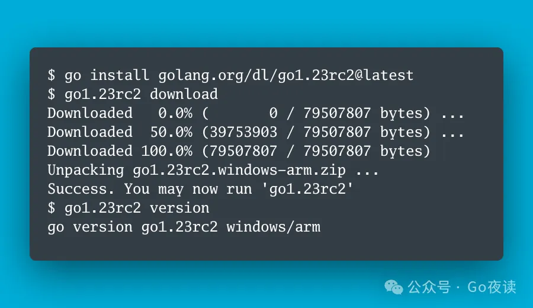

封面图：Go 1.23 Release Candidate 2 is released!

## 🌟 AI 相关

:::tip 技术资讯

- [GPT-4o mini: advancing cost-efficient intelligence](https://openai.com/index/gpt-4o-mini-advancing-cost-efficient-intelligence/)
- [获 OpenAI 370 万美金投资，「连接你生活点滴」的爆火的 AI 应用⚡️ - Dot，其背后核心的「超强个性记忆」技术被 Mem0 给开源了！🔥 目前 9.5K Star ⭐️](https://x.com/tuturetom/status/1813932933482455156)
- [🪄 Sonnet 烂图重造：截图就能发帖](https://x.com/eviljer/status/1814133076001468894)
- [中国现行有十八个税种](https://x.com/Caijingtianxia/status/1813872097304928260)
- [Congrats @openai on the new GPT-4o mini release!](https://x.com/lmsysorg/status/1813999088758673875)
- [GPT-4o mini 太香了，在窗口大小、成本、速度、性能取得了目前最好的折中，提高了整体智能水位 ⚡️](https://x.com/tuturetom/status/1814113127606149626)
- 最具成本效益的智能！🔥GPT-4o mini 最值得关心的几点：
  - 窗口：RAG 之神，总 128K 窗口，最大输出 16K（目前最大）
  - 价格：输入 0.15，输出 0.6，是 3.5 的 60%，是 4o 的 3%（最便宜）
  - 性能：MMLU 82%，综合能力优于 GPT-4 （同级最强），数学和代码能力接近4o
  - 延迟：183 tok/s（最快）
- [A Survey of Prompt Engineering Methods in LLMs](https://x.com/omarsar0/status/1814135222562165104)
- [前 OpenAI 创始人，特斯拉自动驾驶团队负责人 @karpathy 新「AI + 教育」公司首秀课程 「LLM101n」大纲放出⚡️，课程还未发布，已经 21.3K Star ⭐️](https://x.com/tuturetom/status/1813936848969826338)
- [Look forward to attending @icmlconf next week 🇦🇹! Pls join us at our Long-Context Foundation Models workshop: http://longcontextfm.github.io](https://x.com/WeijiaShi2/status/1813679179017400582)
- [继 《CriticGPT》之后 OpenAI 又发布新论文⚡️💥！《证明者-验证者游戏提高语言模型输出的可读性》](https://x.com/tuturetom/status/1813756726354792767)
- [最近使用豆包的浏览器插件频率越来越高了。刚刚又上线了播客和视频总结功能，不仅可以总结视频还可以增加多级目录和思维导图](https://x.com/op7418/status/1813759397421887752)
- [十个简单快速提升气场的方法](https://x.com/0427SMtieshou/status/1813724449348391037)
- [就在刚刚！第一个「为AI 构建搜索引擎」的 AI 搜索 Exa 宣布 1700 万美金 A 轮融资⚡️](https://x.com/tuturetom/status/1813577078069182690)
- [超越 Claude 3.5 Sonnet 和 GPT-4o！1050 tok/s 且支持工具调用？太酷了！💥 @GroqInc 宣布开源 Llama3 8B/70B 的 Groq Tool Use 微调模型！](https://x.com/tuturetom/status/1813752949178581019)
- [十种强到可怕的境界](https://x.com/0427SMtieshou/status/1813770165034840179)
- [本地版的GraphRAG：GraphRAG-Ollama-UI](https://x.com/aigclink/status/1813467615832260932)
- [商用级水准！🔥 RAG 数据清洗关键组件，独创 PDF 内容抽取的 「布局识别」和 「公式识别」模型，达到 SOTA！PDF-Extract-Kit 开源](https://x.com/tuturetom/status/1813468361202057521)
- [一个新的可以在移动设备运行的小型 LLM SmolLM](https://x.com/op7418/status/1813414959105339434)
- [Can 𝐦𝐚𝐜𝐡𝐢𝐧𝐞 𝐮𝐧𝐥𝐞𝐚𝐫𝐧𝐢𝐧𝐠 make language models forget their training data?](https://x.com/WeijiaShi2/status/1812868552162255090)
- [程序员福音，提升 10x 命令行使用效率？Github Copilot X CLI 开源平替来了！🔥 AI Shell 支持你通过自然语言在命令行中语义搜索操作命令！目前已开源 3.8K Star ⭐️](https://x.com/tuturetom/status/1813398058476192071)
- [New model drop from @MistralAI - MathΣtral-7B with 32k context window and Codestral Mamba 7B 🔥](https://x.com/rohanpaul_ai/status/1813251371061182628)
- [On-device deployment  of LLMs is more important than ever. Today we’re releasing SmolLM a new SOTA series of 135M, 360M and 1.7B models: ](https://x.com/LoubnaBenAllal1/status/1813252390692303069)
  - Outperforming MobileLLM, Phi1.5 and Qwen2 small models
  - Trained on SmolLM-corpus, of high quality web, code and synthetic data
- [OpenAI provides a comprehensive guide on enhancing the accuracy of Large Language Models (LLMs), emphasizing methods to improve response correctness and consistency](https://x.com/rohanpaul_ai/status/1813188963181441442)
- [目测 Mistral 这波要开始带飞 Mamba 架构了😂](https://x.com/tuturetom/status/1813238885453033540)
  - 不了解的小伙伴可以查看 Mamba 的论文：https://arxiv.org/pdf/2312.00752
  - Transformer 架构是 「二次方」时间，存在序列长度越长，效率衰减严重的问题，而 Mamba 则号称可以实现「线性」时间推断，和理论无限长度序列的建模，有机会颠覆 Transformer
- [Building Robust LLM Applications for Production Grade Scale using @LiteLLM 🚀🔧](https://x.com/qdrant_engine/status/1812885254429982983)
- [Dokploy 一站式部署平台、Vercel 开源替代品：](https://x.com/luobogooooo/status/1812880284662235598)
  - 🔥 支持自托管部署
  - ✨ 支持多语言（Node.js、Java、PHP等）应用部署
  - 🗃️ 集成数据库管理（MySQL, PostgreSQL, MongoDB, MariaDB, Redis.）
  - 🐳 Docker容器管理
  - 🔍 实时监控
  - 🎯 与Traefik集成实现路由和负载均衡
- [GraphRAG 很强，但是使用的话首先需要有一个知识图谱才行，这个提示词可以从给定的内容中提取知识图谱](https://x.com/op7418/status/1812766080559182041)
- [一个股票 API，包含所有 S&P 500 指数的股票。资产负债表、收入报表、现金流报表都有。支持 30 年的数据，正式版会包含一万五千个股票数据。做金融类 AI 应用非常有用](https://x.com/op7418/status/1813145762710319113)
- [太酷啦！⚡️推上有个老哥 @evilsocket 基于 Rust 开源了「异构集群推理方案」，可组合多台 iPhone,iPad,Macbook 组成 Tranformer 推理服务器，运行 Llama3-70B 模型 🔥](https://x.com/tuturetom/status/1812654489972973643)
- [Reddit 爆火的 Claude 3.5 Sonnet 写 Claude Artifacts 的核心 Coding System Prompt 推出 V2版本！🔥 ](https://x.com/tuturetom/status/1813023405555523634)
- [🤖 GraphRAG 基建：Camel 知识图谱构建](https://x.com/eviljer/status/1812834884517515532)
- [听说这个是 Claude 3.5 Sonnet 写 Claude Artifacts 的核心 System Prompt 🙂👇🏻 在 Reddit 上面传疯了，反正我学会了😂](https://x.com/tuturetom/status/1812873125396435030)
- [斯坦福开源的一个基于LLM的知识管理系统：storm（perplexity pages的平替）](https://x.com/aigclink/status/1812027252345065513)
- [由 @rasbt 撰写并开源的 《从零开始学习 LLM/大模型》，实战教学从零实现一个 LLM 太棒了！⚡️ 短时间内已经飙升 21.9K Star ⭐️](https://x.com/tuturetom/status/1812467490443919689)
- [InferenceClient of @huggingface now supports OpenAI's Python Client](https://x.com/rohanpaul_ai/status/1812128568937202118)
- [As a special weekend release, we’ve implemented an initial working implementation of GraphRAG concepts in @llama_index [in beta]](https://x.com/llama_index/status/1812517033445396754)

:::

[大模型二次开发基本思路](https://mp.weixin.qq.com/s/xByBR3NZOdBeuFu3WdzJQw)

[RAG 工业落地方案框架（Qanything、RAGFlow、FastGPT、智谱RAG）细节比对](https://mp.weixin.qq.com/s/z8CcFi03kQMGoEEQbuHzxw)

[从零预训练LLAMA3的完整指南：一个文件，探索Scaling Law](https://mp.weixin.qq.com/s/aeh6kudCXqkCfd452vUnPw)

[脆弱的不确定性：大模型的可信度如何被操控](https://mp.weixin.qq.com/s/MwMzQ8xV2qfDq8zjMrkTRA)

[KDD 2024｜港大黄超团队深度解析大模型在图机器学习领域的「未知边界」](https://mp.weixin.qq.com/s/oNtb-fi0oGHNiBJDK3jcXA)

[大模型处理29个NLP任务的39种prompt策略总结：兼看2024上半年大模型发展回顾](https://mp.weixin.qq.com/s/1Z9UvCkPFCOi2pAyrsoq6Q)

[仅微调0.02%参数，性能接近全量微调！上交大推出高效微调统一新范式](https://mp.weixin.qq.com/s/J_e_7svrpDuxxefes-s7Xw)

[超长上下文LLM的崛起：对RAG技术的挑战与机遇](https://mp.weixin.qq.com/s/-Bln3s4b7ZUKRqr08E1SSg)

[DSARE：当传统NLP遇到LLM后的关系提取新思路](https://mp.weixin.qq.com/s/CGVq6JSj1lN9Hmp4LkLq_A)

[提示词用上“过去式“，秒破GPT4o等六大模型安全限制！中文语境也好使](https://mp.weixin.qq.com/s/bwJ8ITkzxW3GrvDN8DaZ0w)

[咦？我从GPT-4o mini身上看到了两家中国大模型厂商的影子](https://mp.weixin.qq.com/s/nYmkTgfbN27nkKKvKUzo_A)

[关于垂直领域大模型的探索和尝试](https://mp.weixin.qq.com/s/kcDjGL-SkrsrWH9PoPTedQ)

[可图IP-adapter-plus开源，魔搭送你一本中文咒语书](https://mp.weixin.qq.com/s/8hXDkRIWliZdYRbCDaz53g)

[Hugging Face推出可在手机端运行的小模型；OpenAI用小模型解决“黑盒”难题！](https://mp.weixin.qq.com/s/BLbmW9HpqvFPNaX5UohgRg)

[VILA：教你如何训练多模态理解模型](https://mp.weixin.qq.com/s/YOYaHipK6VsfqP4nnJtm3g)

[通向概率分布之路：盘点Softmax及其替代品](https://mp.weixin.qq.com/s/SyjVHArx3gg2XzyMTRdW4A)

[搞不定结构化prompt优化，用微软的Uniprompt结构化语义分解框架搞定它](https://mp.weixin.qq.com/s/7yJPJNi_Q9mSPX2xiBKLiQ)

[LLM Continue Pretrain（2024版）](https://mp.weixin.qq.com/s/Uq8EPuh9AgOb-d3ZthoK9A)

[YOLO-World：基于视觉语言模型的实时开放词汇物体检测](https://mp.weixin.qq.com/s/bTqQldMDAyqZRiDIWFmbeg)

[Mamba写代码真的超越Transformer！原始论文入选顶流新会议](https://mp.weixin.qq.com/s/BI444cndYuReiJ51L43TUA)

🌟 [阿里云服务领域Agent智能体：从概念到落地的思考、设计与实践](https://mp.weixin.qq.com/s/VBdgDIpmJvrt6fNgLE7i4Q)

[魔搭社区利用 NVIDIA TensorRT-LLM 加速开源大语言模型推理](https://mp.weixin.qq.com/s/gPL7SSqmOIc_1JsL3-JrvA)

[\[LLM性能优化\]聊聊长文本推理性能优化方向](https://mp.weixin.qq.com/s/KUjv9T6OMkHjyZkpUKc42g)

[Reddit传疯的Claude 3.5 Artifacts 的核心系统提示词！Code效果猛增](https://mp.weixin.qq.com/s/3Vfx87dBjTlaw5t2SVf3kA)

[大模型Infra这些年，从黑铁时代到黄金时代再到白银时代](https://mp.weixin.qq.com/s/ldCEJMBkZ3ArXh_-XOs6zQ)

[为视觉语言多模态模型进行偏好优化](https://mp.weixin.qq.com/s/_aPOvVfzwgdL9HOtZIlciw)

[平安科技发表大模型智能客服框架PCA，助力企业级对话系统建设](https://mp.weixin.qq.com/s/19pDwT4g0hyG9h-WwszLAA)

[万字长文，从结构化知识到自然语言理解：探索KG-LLM协同的无限可能](https://mp.weixin.qq.com/s/Vh0RcebIhcH3SNsLyg6VEw)

[清华出品！3万字详解大模型高效推理](https://mp.weixin.qq.com/s/Gjbt1uiWDnH0vr2EnnL26A)

[Mixture-of-Agents系统，竟然如此简单！](https://mp.weixin.qq.com/s/KNl20EdZAnvlix4zHvmw1w)

[深入CrewAI，手把手教你快速构建多智能体系统](https://mp.weixin.qq.com/s/ou9wyMxmkzd8uThsefbQzg)

[LLM推理加速3：推理优化总结Mooncake/AttentionStore/vllm0.5/cache优化 etc](https://mp.weixin.qq.com/s/iw_FBmuBLLj6BujUkxg3dQ)

[登顶开源AI软件工程师榜首，UIUC无Agent方案轻松解决SWE-bench真实编程问题](https://mp.weixin.qq.com/s/v3JvbeMEO2i_3Ms17badmQ)

[微调 Florence-2 - 微软的尖端视觉语言模型](https://mp.weixin.qq.com/s/2czoWNCyBC37ekCLD0ugow)

[从关键词匹配到知识理解：微软 GraphRAG 掀起革命，Neo4j CTO 详解其如何引领智能检索新时代](https://mp.weixin.qq.com/s/wrNi_iZqyPUdn_mZE74FnA)

[大模型预训练认知分享：如何从零开始训练大模型](https://mp.weixin.qq.com/s/Etm5MnJJmyPXWmTjmK2gug)

## ⭐️ Go & 云原生 & Rust 相关

:::tip 技术资讯

- [rust-ontologist - 一秒生成代码关系图](https://github.com/lava-xyz/rust-ontologist)
- [kartoffels - 利用Rust写bot，上传到服务器进行对战](https://github.com/Patryk27/kartoffels/)
- [ruskel - 利用LLM生成对crate的概览](https://github.com/cortesi/ruskel)
- [如何组织大型Rust代码库](https://kerkour.com/rust-how-to-organize-large-workspaces)
- [A web chat app for teams, sass with user management and rate-limit, support ChatGPT(openAI & azure), claude, gemini and ollama model #golang based API](https://x.com/golangch/status/1813850326417773035)
- [Discover how to create native Mac apps easily with Go using DarwinKit. Latest update features 33 frameworks and near full Apple API coverage](https://x.com/TheGoDev/status/1813321713909674251)
- ["HTMX + Go : Build a CRUD App with Goland HTMX" by @coderonfleek #golang #DEVCommunity](https://x.com/golangch/status/1813159185359548423)
- [Deep Dive into Go: Crafting a CRUD RESTful API Without Frameworks](https://x.com/golangch/status/1812732031748465052)
- [FanIn-FanOut Concurrency Pattern in #Golang](https://x.com/GolangTrends/status/1812825944492527944)

:::

[Rust中的panic!：在安全与效率间寻求平衡](https://mp.weixin.qq.com/s/gHHAp6mCHLxb-yyupfHCGg)

[Go 运行时调度器：深入解析并发执行的奥秘](https://mp.weixin.qq.com/s/NDwThnb-0RjgOPk0qP38TQ)

[深入理解 Go 语言并发编程中的 Mutex](https://mp.weixin.qq.com/s/op2IAy92M_FgDXj4_tcCbA)

[Golang 使用 upx 减少可执行文件的大小](https://mp.weixin.qq.com/s/EAFa7DiTkl_AMu--IQ634Q)

[Rust 语言中的数组和切片](https://mp.weixin.qq.com/s/z94VQDrQ6LkkVxdj4yJxNg)

🌟 [Go 锁的实现与应用](https://mp.weixin.qq.com/s/Jku_c3AHZ6lAKVWCEO__jA)

🌟 [项目重构为Go实现后，对 DDD 实践的思考](https://mp.weixin.qq.com/s/VbkdHruWfTbSlnCCieF1Nw)

[Golang 垃圾回收：一次 GC 周期的详细过程](https://mp.weixin.qq.com/s/_Ys-CXgEoqZlS4cTAQ5wqQ)

[利用 Redis Bitmap 实现高效的用户签到统计功能](https://mp.weixin.qq.com/s/NkFUOOX330G8w2IDOTOMQA)

[深入理解Go标准库-http server的启动](https://mp.weixin.qq.com/s/s3BWg6iiCcDZRFh7oZJj5Q)

[深入理解Go标准库-ServeMux的使用与模式匹配](https://mp.weixin.qq.com/s/TU9FL2SVe5TW7Uq5I0o_Sg)

[SQL实用技巧-行列转换](https://mp.weixin.qq.com/s/bZMsoiDWtj41f4I-qWkdaA)

🌟 [用Go开发项目怎么做好并发抑制](https://mp.weixin.qq.com/s/lLC1bqFjAgNXuly2NNe6Mw)

[7 张图，彻底讲透 Prometheus 架构原理，收藏备用](https://mp.weixin.qq.com/s/ZeaDS35ox-NX1uJhkugChg)

[深入剖析 Kubernetes 原生 Sidecar 容器](https://mp.weixin.qq.com/s/x9bcRjWUiWdtQokHlU0MrQ)

[Rust 语言跨平台编译从入门到精通](https://mp.weixin.qq.com/s/E8KUnytRNdPpGCgP7Xk0iA)

🌟 [Bilibili 开源 Go 微服务框架 Kratos](https://mp.weixin.qq.com/s/0shcXTZ1e_ikmegufutSbg)

🌟 [Go-Zero实战：抽奖算法的设计与实现（七）](https://mp.weixin.qq.com/s/Gxi3BZzf-7I5v7vVnUMF9w)

[Linux 中停止 Docker 服务报 warning 导致无法彻底停止问题如何解决](https://mp.weixin.qq.com/s/t16jxgRT6fw06YTaDS6OUQ)

[给Rust初学者的学习建议](https://mp.weixin.qq.com/s/YHGXFM-W0xHu-4niNWZKRQ)

[Go 1.23 Release Candidate 2 is released!](https://mp.weixin.qq.com/s/gK42fKsEacV8f8C2IEDaeg)

[Go 夜读第 157 期从 0 到 1 用 Claude.ai 开发个人作品集网站](https://mp.weixin.qq.com/s/s4AnEFsUY8NjY89SszRlRw)

[发现了一个 Go 最小化日志系统的好轮子](https://mp.weixin.qq.com/s/hWJqICAcPHzuKnJlyygWEg)

[DockerHub 拉取镜像，终极解决方案！](https://mp.weixin.qq.com/s/gPqACbV1_6YX1-toavorYQ)

[你不知道的 Dockerfile 增强新语法](https://mp.weixin.qq.com/s/jcyxEc32kGErm2XBekvlSg)

[在 Go 项目中使用 Redis 的几个实用建议](https://mp.weixin.qq.com/s/40LF1cnlA2prBFiAp7Jp6A)

[Enhancing Kubernetes API - 挂载K8S资源为本地云盘](https://mp.weixin.qq.com/s/SCe-r9EZ1uaJO6CXa39JBw)

[通过实例理解Go访问和操作数据库的几种方式](https://mp.weixin.qq.com/s/uUqWzabm6yoKuz3rhAvrpA)

[Rust必知必会库001: thiserror 和 anyhow](https://mp.weixin.qq.com/s/_8KZCdbKz2CNtppk-sEktA)

## 📒 后端相关

🌟 [如何理解：业务架构、应用架构、数据架构、技术架构与系统和复杂度](https://mp.weixin.qq.com/s/jaXXrZsKvVhodaLKb35IwA)

[40 个定时任务，带你理解 RocketMQ 设计精髓！](https://mp.weixin.qq.com/s/N-evKHlpvLnRB-Yc675YSg)

[Redis只能做缓存？太out了！](https://mp.weixin.qq.com/s/dxbfQ8VVR9jEjRm-kYFpyg)

[不引入ES，如何利用 MySQL 实现模糊匹配](https://mp.weixin.qq.com/s/eu-CNomBod89RLO8H9quvg)

[21 条MySQL 开发规范，太详细了，建议收藏！](https://mp.weixin.qq.com/s/8IheQeBCZMCaPuCvdsDlbw)

[为什么 MySQL 事务默认隔离级别是可重复读](https://mp.weixin.qq.com/s/XzC3M6hwtWl6iRFiZZM9Vg)

[Redis 主从同步原理是什么](https://mp.weixin.qq.com/s/uyNfNxFEq2PxO9ee7eG4GQ)

[为什么 mysql 插入不存在的数据会产生死锁](https://mp.weixin.qq.com/s/HfQiMR7dgTzCV1Y65-jTlA)

[云消息队列 RabbitMQ 版入门训练营，解锁对比开源优势与零基础实战](https://mp.weixin.qq.com/s/rbqhNzOqKDP6Rkuc8uIA7g)

[AI 时代，网关更能打了](https://mp.weixin.qq.com/s/_7d7j6R6843s-_mIY7at8g)

[图解Kafka的内部架构和其发展历程](https://mp.weixin.qq.com/s/Jx4FOVCG-L4hdiUAEm9dFA)

## 📒 前端相关

:::tip 技术资讯

- [shadcn 推出 Charts：shadcn 推出 Charts 系列图表组件，基于 Recharts 构建，带有主题色配置](https://ui.shadcn.com/charts)
- [pnpm 9.5 引入了目录：可共享的依赖版本规范](https://socket.dev/blog/pnpm-9-5-introduces-catalogs-shareable-dependency-version-specifiers)

:::

🌟 [ES+Milvus实战落地全文检索业务](https://mp.weixin.qq.com/s/9ZyMRQUs5R6IZRzZhs0etw)

[豆包Marscode体验官：用云编译器半小时完成轮播组件紧急开发！被公司奖励500！](https://mp.weixin.qq.com/s/kZupNUzVkN7gmQkVf5bSUg)

[有点东西，template可以直接使用setup语法糖中的变量原来是因为这个](https://mp.weixin.qq.com/s/DgEIKuqOV9lyXc05cxIXmQ)

[基于wujie的解决方案来简单聊聊微前端](https://mp.weixin.qq.com/s/itpDF1LCImOLfDfLpF31oA)
