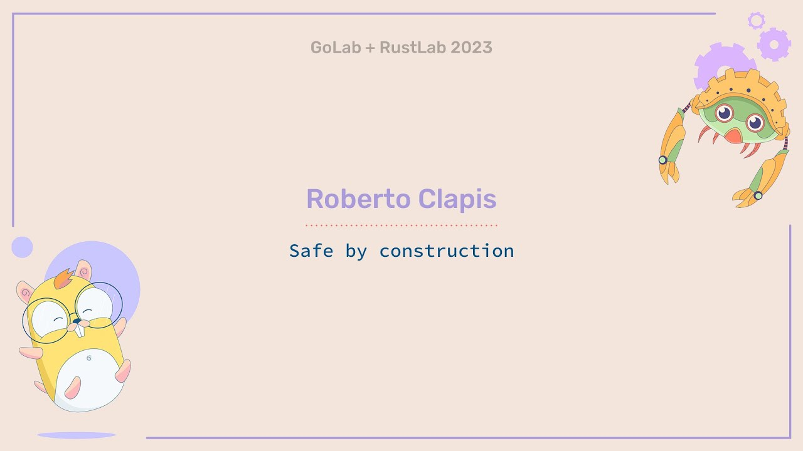

封面图：Safe by construction - Roberto Clapis

## 🌟 AI 相关

[TC-RAG: Turing-Complete RAG--图灵完备的检索增强](https://mp.weixin.qq.com/s/9VhIC5sJP_6nh_Ppfsb6UQ)

🌟 [Weavel Ape超过DSPy，或将成为最好用的提示（prompt）优化工具](https://mp.weixin.qq.com/s/iV34tT-wkPddFiI92KdUWw)

[小波降噪加持，xLSTM-TS 模型解码股市“天机”](https://mp.weixin.qq.com/s/OtXhTsD-44uauV9JpihcKA)

[Karpathy狂赞AI代码神器Cursor，直言回不到3年前无辅助编码了，却被指「带货」](https://mp.weixin.qq.com/s/oMD7pNABpwOTnpGadhpuGw)

[如何解读 Yann LeCun推文建议学生不要在大模型方向工作](https://mp.weixin.qq.com/s/JweLq9IirIL9atKl4TzLTA)

[RAGLAB、TC-RAG、CommunityKG-RAG、W-RAG：这周怎么这么多RAG](https://mp.weixin.qq.com/s/JqT1wteHC43h2cPlXmPOFg)

[李沐重返母校，上交大秒变追星现场，大模型趋势无保留分享](https://mp.weixin.qq.com/s/mbqHqiz9H7BNmUijaPI67w)

[我们给大模型去掉了“AI味”-大模型微调全链路实战](https://mp.weixin.qq.com/s/BpTOlOIk2qTnd1oBJZ4EJg)

[以DeepSeek-VL为例，详解视觉语言模型原理及代码](https://mp.weixin.qq.com/s/eRvTJcplaszo3GCrx4IAfA)

[用于复杂RAG任务的先进可控Agent](https://mp.weixin.qq.com/s/SDTE5LZLegXyIi3DxSRuvg)

[【LLM模型微调】LLMs-PEFT[微调]-LoRA总结笔记v5.0](https://mp.weixin.qq.com/s/ltwEH5kLOjJ_OGys57vH9g)

[如何用Prompt技巧激发无限创意](https://mp.weixin.qq.com/s/Qlz2iyO6dN4-MWJmIHZIiQ)

[FLUX第三弹：直面天命，FLUX.1-LoRA/IP-adapter「黑神话：悟空」生图实战](https://mp.weixin.qq.com/s/7NavuJUzR7DwTZn45QfdPw)

[微软「小而美」系列三连发！视觉小钢炮 PK GPT-4o，MoE 新秀力压 Llama 3.1｜AGI 掘金资讯](https://mp.weixin.qq.com/s/7Iz14lcz7eriVzFooPSF3Q)

[豆包“听力”水平现场开箱！看Seed-ASR如何突破语音识别瓶颈](https://mp.weixin.qq.com/s/4eUPcojYxNWlBZCFDhop6A)

[英伟达仅用380B tokens训练刷新8B模型新SoTA，剪枝和蒸馏应该这么用](https://mp.weixin.qq.com/s/RMZc-GRNktlbJw-_uh8IZA)

[社区供稿 | 使用 Hugging Face 和 Milvus 构建 RAG 系统](https://mp.weixin.qq.com/s/3_VHwotNlPtv9c3WGMEnQg)

[大模型厂商纷纷入局的Prompt Cache技术解析](https://mp.weixin.qq.com/s/xXlrw7kgVyD1_0rOuYm-cQ)

[披上Agent盔甲的RAG，从此不再只是召回生成！](https://mp.weixin.qq.com/s/nNsJ3ZzyrP2bZUgL5oZIIw)

[Plan-based Retrieval，告别AI的胡言乱语](https://mp.weixin.qq.com/s/hQ5LGGWGhsFdfK8jCtdsDw)

[速度与精度的结合：Faster R-CNN模型的性能剖析](https://mp.weixin.qq.com/s/p3C_DvLdMU8YwrXSyb_1gg)

[Ilya Sutskever 预测：GPT-5 之后，AGI 将降临](https://mp.weixin.qq.com/s/ulmrLqvLgjK2ndLfTZfzJA)

[一文看懂GraphRAG：蚂蚁集团联合各所名校出品GraphRAG综述](https://mp.weixin.qq.com/s/NoxEMm94WgjI9CMR0hc6lA)

[不花一分钱！GPT-4o微调限时免费开放，每日附赠百万训练token](https://mp.weixin.qq.com/s/1iQmUOTHw_vOpFWkQ9zpUw)

[多图理解，更懂中文，支持function call的Phi-3.5来了！](https://mp.weixin.qq.com/s/QzwDumKV-A1-t9LYi8a15Q)

[大模型训练实战经验总结](https://mp.weixin.qq.com/s/ItpCTCcMjTWQJtgpvdwTfw)

[谢谢微软，又又又Open了！一口气发布3款Phi-3.5新模型，领先Llama3.1和谷歌同级模型](https://mp.weixin.qq.com/s/pST2aZI1VPc_4ruMtzGxYg)

[1000个样本胜过百万数据?Meta AI最新研究引发行业震动](https://mp.weixin.qq.com/s/6e4jnpFCLLaRBQ9af0wEWQ)

[极限套娃，Agent自动设计Agentic系统！](https://mp.weixin.qq.com/s/wb9VYJaQ3uViyRUGdnAMtA)

🌟 [RAG 检索大升级：BM25 与 RRF 助力 LLMs 精准破局](https://mp.weixin.qq.com/s/Cj27dsJp_hC8oNmsQd0x7g)

[使用 Dify 和 AI 大模型理解视频内容：Qwen 2 VL 72B](https://mp.weixin.qq.com/s/C1fHZKUl8KuS9uTV6b3BYg)

[一文讲明白大模型显存占用（只考虑单卡）](https://mp.weixin.qq.com/s/IBWobzTtJKT65UDNr8p81Q)

[使用FP8进行大模型量化原理及实践](https://mp.weixin.qq.com/s/4Mg7Zhgz45zt57QCDT339Q)

[大模型到底需要消耗多少GPU显存？公式和工具全都有](https://mp.weixin.qq.com/s/FFHCCXZypBZ4OJr9CNxjcg)

[Multi-Meta-RAG：langchain点名，评论爆吹的新研究](https://mp.weixin.qq.com/s/Jf3qdFR-o_A4FXwmOOZ3pg)

[RAG真的是LLM的未来吗](https://mp.weixin.qq.com/s/8lX6BkuhXk33HFaTP34z_A)

[OpenAI 绝密项目「草莓」技术详解](https://mp.weixin.qq.com/s/FCcBYT0y5FYQfmQ4BJBAdg)

[AgentWrite：为什么你的模型生成的内容长度总是不超过2K](https://mp.weixin.qq.com/s/1LpyH-mhsYVcJHVk7TQDXg)

[Meta-Rewarding ：LLM对齐新技术](https://mp.weixin.qq.com/s/qW-e_ye3aqcQ63W6JJi-1g)

🌟 [RAG 进阶：一个 ctrl-c 就能拿走的图文检索框架](https://mp.weixin.qq.com/s/ttmLyw9idsfnxFYoOcfTXA)

[RAG 如何选择 chunksize 和 splitter](https://mp.weixin.qq.com/s/ogDOyUhy1pAvSadTDt0pSA)

[工业界Agentic RAG方案-Golden-Retriever](https://mp.weixin.qq.com/s/_w7xV_V_8WHHDpiHqKvO1A)

[WeKnow-RAG:结合网络搜索和知识图谱的自适应检索增强生成方法](https://mp.weixin.qq.com/s/TdmtUN6zBn5R88jmv2CJIg)

[阿里开源通用多模态大模型mPLUG-Owl3：迈向多图长序列理解](https://mp.weixin.qq.com/s/Zm5HNCvbOiihF8KyH2lQiA)

## ⭐️ Go & 云原生 & Rust 相关

:::tip 技术资讯

- [QUIC协议的一些基操解释](https://www.iroh.computer/blog/closing-a-quic-connection)
- [Rust实现的一个狭义相对论模拟](https://sogebu.github.io/special-relativity-web/20240810/#simulations)
- [Rust中的Mutex, Atomics 和 UnsafeCell](https://leon.schuermann.io/blog/2024-08-07_rust-mutex-atomics-unsafecell_spooky-action-at-a-distance.html)。这篇文章主要讨论了Rust中的Mutex、Atomics和UnsafeCell的实现原理和相关概念:
  - 文章通过自定义实现AtomicUsize来探讨原子操作的原理。作者发现简单使用UnsafeCell并不能实现真正的原子性,因为编译器会对其进行优化。
  - 真正的原子操作需要使用编译器内部函数(intrinsics)来实现,这些函数不仅生成原子指令,还会告诉编译器不要对其进行优化。
  - Mutex的实现基于UnsafeCell和一个原子整数。获取锁时使用原子的compare_exchange操作,释放锁时使用原子操作配合内存顺序(memory ordering)来保证可见性。
  - 内存顺序(如Acquire和Release)不仅影响生成的机器指令,还会限制编译器的优化,从而保证跨线程的内存访问顺序。
  - VolatileCell用于嵌入式系统中访问内存映射I/O。它使用volatile读写操作,但仍存在一些安全性问题。
  - volatile操作与原子操作不同,不能建立happens-before关系。对于DMA等操作,需要额外使用内存屏障(fence)来保证顺序。
  - 文章深入探讨了UnsafeCell、原子操作、内存顺序等概念如何在底层影响Rust的并发安全性,对理解Rust的并发模型很有帮助。

:::

[Range Over Function Types](https://go.dev/blog/range-functions)

[Go 1.23 is released](https://go.dev/blog/go1.23)

[Go 1.18之后的语法新特性Quiz，你能做对几个](https://mp.weixin.qq.com/s/12CYni0M0Ek3p_lYfGhz4g)

[Rust的Pin类型是用来做什么的，以及为什么它很难使用](https://juejin.cn/post/7394789388143067145)

[Rust 中 @ 符号的高级应用和最佳实践](https://juejin.cn/post/7366177423774482432)

[[译] Range Over Function Types](https://mp.weixin.qq.com/s/TUTvwZiIzE1LEiIs-Xhw6A)

[探索 Go 标准库中的优雅设计模式：函数与接口的结合](https://mp.weixin.qq.com/s/8PyL80QJQe3tlg1MQTVwmw)

[Go 入门指南：5.2. 测试多返回值函数的错误](https://mp.weixin.qq.com/s/JTjGTcPB6JL566NY3XPxuQ)

[Go 项目结构的简洁实现 | GitHub 3.5k](https://mp.weixin.qq.com/s/Ivrg1_0afSRZOkY-VYs0Vg)

[Go GOPATH 模式未来会怎么样，会消失吗](https://mp.weixin.qq.com/s/GLCW-6J1j9YhVqU0rrtqXQ)

[Go1.23 新特性：再开后门，可以记录未捕获的 panic 和 throw 日志了！](https://mp.weixin.qq.com/s/D16riVBbnDibLueQBIQ6Pw)

🌟 [Kitex Thrift Streaming 在字节跳动 Prompt 平台的实践](https://mp.weixin.qq.com/s/f6dF415o4JbzFbNoZSkOTg)

[一款支持自动流水线和客户端缓存的 Go 语言 Redis 客户端](https://mp.weixin.qq.com/s/6BTRDyjSQIHtLo3Azk8qmQ)

[Go必知必会：协程（上）：进程、线程、协程的区别和联系](https://mp.weixin.qq.com/s/-QrMsdOmBqnz50fAS0K9yw)

[Golang面试题：strings 和 strconv 包](https://mp.weixin.qq.com/s/r6k3CGpP1qXz-vVmeChOIw)

[基于 Gin 框架的 Go 后端架构最佳实践](https://mp.weixin.qq.com/s/DaCkIznCqxHeInNP5fYNgA)

[继Ollama之后，Go在AI领域再下一城](https://mp.weixin.qq.com/s/HPCdIwREB_wgylOWjxIsHQ)

[了解 Golang 中的内存管理：Stack vs Heap](https://mp.weixin.qq.com/s/BxBcX3gzIqaZfqziSvs1HA)

[Go必知必会：构建复杂数据模型的基石](https://mp.weixin.qq.com/s/LnDH9o4B3Vo3Dts_NjiD6A)

[Go 1.23中值得关注的几个变化](https://mp.weixin.qq.com/s/GvPDgWP6BjxllLPNnSNS3A)

[写给go开发者的gRPC教程-通信模式](https://mp.weixin.qq.com/s/SLQWWmOgqoj-8Ah3lsM3aQ)

[Golang面试题：基本类型和运算符](https://mp.weixin.qq.com/s/ygKWKp8TSfc1GGbPiUaKWg)

## 📒 后端相关

[互联网根服务器只有13台，是真的吗](https://mp.weixin.qq.com/s/Wl2xyKF3Ypjlfm5qPDNX9Q)

[一线实战：运维人少，我们是如何从 0 到 1 实践 DevOps 和云原生](https://mp.weixin.qq.com/s/QwFmQDCNl83HMSc6pkQZnA)

[千万级数据的全表update的正确姿势！](https://mp.weixin.qq.com/s/5q1E2whNqaM3J2dAZFQwlg)

[系统设计：在搜索系统实现缓存的策略与思考](https://mp.weixin.qq.com/s/7SSFCj50SLS2g_u2opc_Dg)

[ByteHouse高性能向量检索实践——“以图搜图”](https://mp.weixin.qq.com/s/-cKEnIUvn1Fhn_UjA-qVRg)

[AI 网关零代码解决 AI 幻觉问题](https://mp.weixin.qq.com/s/_Ssm_AkiyAsfid2vSIucvw)

## 📒 前端相关

[2024最新VSCode实用插件推荐，开发效率遥遥领先！超全面，快收藏~](https://mp.weixin.qq.com/s/CGcX9tZ9b1uKl7yMcS4uHQ)

[把黑神话悟空视频设置为vscode背景，真的太炫酷了](https://mp.weixin.qq.com/s/QH0jK8tWlPXus2Z3EkcFQw)
