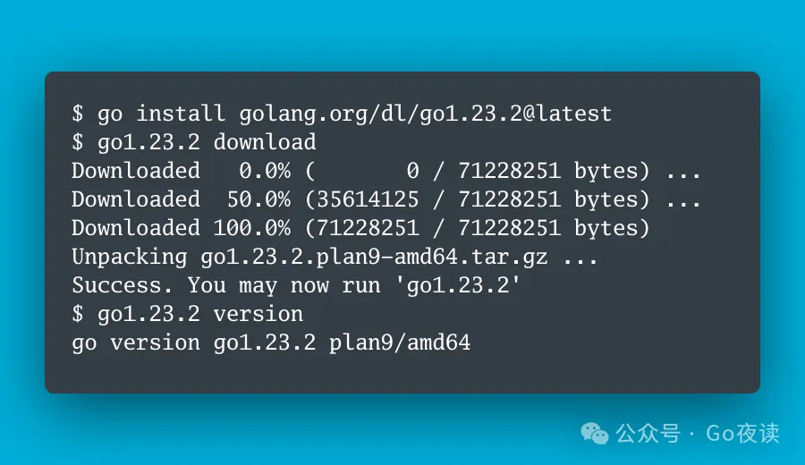

封面图：Go 团队进入静默期，我们升个级就开始搬砖

## 🌟 AI 相关

[给小学数学题加句「废话」，OpenAI o1就翻车了，苹果新论文质疑AI推理能力](https://mp.weixin.qq.com/s/I1oODHlYWSidgSzGiseQ-g)

[CodePMP：提升LLM推理能力的可扩展偏好模型预训练](https://mp.weixin.qq.com/s/mkt-jCptwUtLH44Ni_GwUg)

🌟 [openai今天open了2下，prompt自动生成器、Agent框架开源](https://mp.weixin.qq.com/s/ysUzxUYV-lsQ6aiYPU0KdA)

[OpenAI今天Open了一下：开源多智能体框架Swarm](https://mp.weixin.qq.com/s/3-iKztrTuRURUGtles4-xA)

[海量大模型如何一键部署上云？函数计算 x ModelScope 社区给出答案](https://mp.weixin.qq.com/s/FtZvpkA07s28hX34PPnBNg)

🌟 [OpenAI终于open了，Swarm开源来袭~](https://mp.weixin.qq.com/s/PUsQHrDfgiwuhTiolag0tA)

[GPT-4o的开源平替！和一作聊聊开源交互式多模态基础大模型VITA的架构实现](https://mp.weixin.qq.com/s/a_TD499ODbqpWaGeXcPOLA)

[AIOps在小红书的探索与实践——故障定位与诊断](https://mp.weixin.qq.com/s/5KOpCFJ0SuWQ-qe9_U4Qyg)

[忘记Tool检索，拥抱全新Agent ToolGen！](https://mp.weixin.qq.com/s/lCIfFlm-5JsAa4nI7rsIkw)

[唯一答对“strawberry中有几个r”的开源项目，被我找到了！](https://mp.weixin.qq.com/s/CdhW2XVEdjT9TgpA7kwJlA)

[RAG 的未来 - 自动文档检索](https://mp.weixin.qq.com/s/NC9MXjZmWubiLLhfKmXp1Q)

[现代LLM基本技术整理](https://mp.weixin.qq.com/s/xkU_D61TpKA4x2gpJOr4gA)

[o1推理扩展的风吹到了RAG，性能飙升58.9%！](https://mp.weixin.qq.com/s/1VPDIjnWis7NMSLp0SF4uw)

🌟 [大模型在问答领域的探索和实践](https://mp.weixin.qq.com/s/7odSdOscy9EjE5F6W7_SGQ)

[Google新研究：适用于百万级单元格的TableRAG](https://mp.weixin.qq.com/s/n0iu6qOufc1izlzuRjQO6g)

[SGLang、FlashInfer和MLC LLM：探讨大模型LLM高效部署和服务](https://mp.weixin.qq.com/s/F5L7FLv5nF1cuoVvHYxZ5g)

[探索多模态大模型的最佳技术路线](https://mp.weixin.qq.com/s/y4kTtEhKgGpLi3SqNaG7rQ)

[OpenAI o1 技术初探2：使用MCTS增强推理能力（基于代码实践的解读）](https://mp.weixin.qq.com/s/-IoR0VPhqmAh5AlEbU3RWg)

🌟 [从0手搓4种Agentic模式，主打去框架化!](https://mp.weixin.qq.com/s/BQzMbDsrrGzXOVIXNiSlFQ)

[vLLM vs TensorRT-LLM 性能对比测试，基于0910较新版本](https://mp.weixin.qq.com/s/jQZGRu7ZxKN5tHFFJ6E3Gw)

🌟 [卷不动了？Agentic的4种设计模式直接上手！](https://mp.weixin.qq.com/s/GvSTPBo2gPxFJ61YvaFSdg)

[Ultralytics YOLO11来啦！更快！更强！](https://mp.weixin.qq.com/s/Xx-jyN11Ot-rv5gGxhchqw)

[基于大模型的生成式推荐在京东健康电商标品推荐中的应用](https://mp.weixin.qq.com/s/Npe_NJiwAs7f-TA33zcutg)

[全是细节 | 聊一聊做SFT的经验](https://mp.weixin.qq.com/s/DMJv0GpmkG2VPfsmaOaTlw)

[ASB：LLM智能体应用攻防测试数据集](https://mp.weixin.qq.com/s/rCba5E_zkc4wOp151Q3W9A)

[Open o1：开源版o1 来了！](https://mp.weixin.qq.com/s/OPz9A5Lw6lHrsL3Xq2I_Sg)

[一种将RAG、KG、VS、TF结合增强领域LLM性能的框架](https://mp.weixin.qq.com/s/bpzUC8OIBc1IEqfAUOC7Pw)

## ⭐️ Go & 云原生 & Rust 相关

[Go 入门指南：11.4. 类型判断：type-switch](https://mp.weixin.qq.com/s/7Q1o9a-OT85rBeGK0LkYcA)

[Go 入门指南：11.3. 类型断言：如何检测和转换接口变量的类型](https://mp.weixin.qq.com/s/YU53lCQb9qjaTYS05UxNTA)

[Go语言演进的双保险：GOEXPERIMENT与GODEBUG](https://mp.weixin.qq.com/s/vAH5yzFuWo6oXiNIh1dhaQ)

[7 个实用技巧帮助你更好地玩转 Go Structs](https://mp.weixin.qq.com/s/eRpjQn9GOZCV3prQsrQLpA)

[那些年，我们在Go中间件上踩过的坑](https://mp.weixin.qq.com/s/2ErKqMwYpWNWHTtqgjj9WA)

[Go 语言中的 os.Stat() 与 os.Lstat()](https://mp.weixin.qq.com/s/5EI6VudREsyzrWagtSW0Sw)

[Go 入门指南：11.1. 接口是什么](https://mp.weixin.qq.com/s/4qUcTCm3aSIpgHvnUxt3vw)

[Go语言中位操作还能这么搞？难怪别人的程序性能那么好](https://mp.weixin.qq.com/s/gwLTkaZ4WP9JZQTzH4kpGw)

[Go 入门指南：11.2. 接口嵌套接口](https://mp.weixin.qq.com/s/HJPGOIYJvxbPIsl3AZerag)

[Go 入门指南：10.8. 垃圾回收和 SetFinalizer](https://mp.weixin.qq.com/s/jXaMuoXpj01EjuTRBrTpdA)

[Gin项目的初始化步骤和常见错误记录](https://mp.weixin.qq.com/s/VNt257VIQIAkXfEU53VTcQ)

[Go 团队进入静默期，我们升个级就开始搬砖](https://mp.weixin.qq.com/s/UpUPUv1NPx1hWdhTjE3UGA)

[gRPC微服务—服务发现的原理和使用示例](https://mp.weixin.qq.com/s/GeYXbh3yO-DaIkeCgwPUtQ)

[从DevOps到日常脚本：聊聊Go语言的多面性](https://mp.weixin.qq.com/s/mnBwdO0B_GoKXtHoWbI6Gg)

[Go 入门指南：10.7. 类型的 String() 方法和格式化描述符](https://mp.weixin.qq.com/s/i1ZSbJLWXCGwJT92oZartA)

[担心你的 Golang 程序内存泄露？看这一篇就够了！](https://mp.weixin.qq.com/s/jZ3l7zRMdrwnZ7TwkoPJBQ)

[Go 零依赖结构化日志处理](https://mp.weixin.qq.com/s/AjqGVr2uToe-NREpsFhKFw)

[Go 入门指南：10.6. 方法](https://mp.weixin.qq.com/s/QlX-w2nt32FsARC-h-Ns_g)

## 📒 后端相关

[MySQL 是怎么做并发控制的](https://mp.weixin.qq.com/s/EjKtAj9H6KpuRlWAfoLYSA)

[Seata+TCC 解决分布式事务，真香！](https://mp.weixin.qq.com/s/JVIzbO6PgBr3ac1_o2LNVw)

[京东面试：Redis主从切换，锁失效 怎么办](https://mp.weixin.qq.com/s/1DmDQp5mXNdSIkNSQ6exIQ)

## 📒 前端相关

[浅读Vue3代码10万行，总结出30个代码规范](https://mp.weixin.qq.com/s/mDMqb2GUMOmvUAtIW7ayFg)

🌟 [逐步解析 | 如何使用 LangChain、NestJS 和 Gemma 2 构建一个 Agentic RAG 应用](https://mp.weixin.qq.com/s/PHMheJXFiN-1tj6CC2A38g)

🌟 [使用Nest.js+LangChain给低代码平台赋上AI代码生成能力，让低代码变成低低代码！](https://mp.weixin.qq.com/s/1KAgBFMAUw-QIzEaEkTcLQ)
