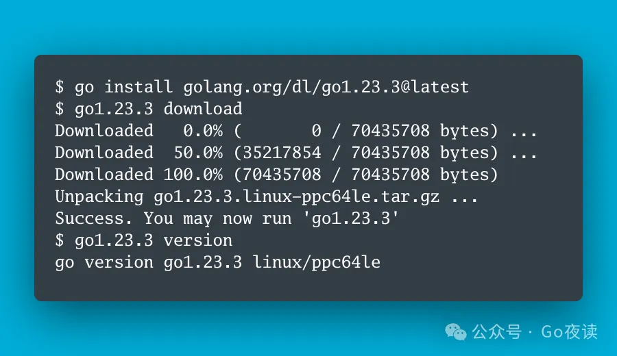

封面图：Go 1.23.3 值得更新的一个 fix 版本

## 🌟 AI 相关

[Ollama 更新！手把手教你用Ollama轻松搭建Llama 3.2 Vision + 视觉RAG系统（本地安装）](https://mp.weixin.qq.com/s/6X6jglxC9rBiMv-HIMRcrA)

[DPO新作From r to Q* 解读，以及与OpenAI Q* 的联系](https://mp.weixin.qq.com/s/fo2Wbrzl0Dg54wxZvohCZQ)

🌟 [微软开源5级Agent框架，复杂任务就这么被解决了~](https://mp.weixin.qq.com/s/ZynyrRx1pTZUrJJa4wtpVg)

[考古OpenAI RLHF基石之作：探索RL和RM阶段的Scaling Law](https://mp.weixin.qq.com/s/vJysXhWs8riE1YQ_Z-SQBw)

[RAG三件套运行的新选择 - GPUStack](https://mp.weixin.qq.com/s/mW9aSiH8_JtbSVcQwWLl7g)

[vLLM这一年的新特性以及后续规划（总结版!）](https://mp.weixin.qq.com/s/ISltFRwFSNlgsnrzUnBTiw)

[打破文本边界：如何进行多模态RAG评估](https://mp.weixin.qq.com/s/IIg1hPwhADYb0vs3Hqzfgg)

🌟 [RAG2.0 引擎设计挑战和实现](https://mp.weixin.qq.com/s/zL60SnpqkNJjsh3IEDUYXQ)

[你要的增量更新来了：微软GraphRAG 0.4.0](https://mp.weixin.qq.com/s/az6nE8j9JMZVjgaa1rHwjg)

[15种典型RAG框架：卡内基梅隆大学最新RAG综述](https://mp.weixin.qq.com/s/ogI1CtuhRDb5eRqCP2Hssw)

[全参微调与LoRA的区别，及7种LoRA变种方法解析](https://mp.weixin.qq.com/s/1E9xW9sdzgyMckD6WdLppA)

🌟 [三连发！1.7B小模型把大厂干懵了~](https://mp.weixin.qq.com/s/ozlW5tUcrYZHqJbcYZp_oA)

[LLM每周速递！大模型最前沿：多模态RAG、RAG加速、大模型Agent、模型微调/对齐](https://mp.weixin.qq.com/s/DKho9ySmsLCeZqVGfMSxEg)

## ⭐️ Go & 云原生 & Rust 相关

[Go 入门指南：13.5. 一种用闭包处理错误的模式](https://mp.weixin.qq.com/s/I17AXWjVM0iOn-oRTXjfsw)

[二刷《凤凰架构》，关于微服务的思考：它是项目复杂性的“解药”吗](https://mp.weixin.qq.com/s/AWOEx2KSfvhB84NhAX5Q7Q)

[kubectl 执行一条命令之后发生了什么](https://mp.weixin.qq.com/s/qRwqkRGeg8J9d0DiGm9Tew)

[Go 入门指南：13.4. 自定义包中的错误处理和 panicking](https://mp.weixin.qq.com/s/FTv0y8-_yIg-b2D-M_XUfw)

[Go 1.23.3 值得更新的一个 fix 版本](https://mp.weixin.qq.com/s/qYL2y-3KbXSGlRVJuQ463g)

[使用Go构建Web应用：MVC模式、Gin框架、GORM和JWT](https://mp.weixin.qq.com/s/mgOgE-lg0pOcrHwbpW_qsg)

[docker-mirror：神奇指令，一键把镜像拉回“家”](https://mp.weixin.qq.com/s/QFPPcaTbBrnoGfuPxePjKA)

[Go 项目怎么做好分层架构和目录规划](https://mp.weixin.qq.com/s/j81mKD_AEOMuVckY3uOcGg)

[Go 入门指南：13.2. 运行时异常和 panic](https://mp.weixin.qq.com/s/iZeulv1OQCIfqb7bH7Molw)

[Go 入门指南：13.1. 错误处理](https://mp.weixin.qq.com/s/MX40JTqp0TmNYwWuiCmiXg)

[Go中秘而不宣的数据结构 BitVec：位向量125MB存储10亿个数据](https://mp.weixin.qq.com/s/mtyHsHkgZ6shymsQnRbeMw)

[Go 入门指南：12.12. Go 中的密码学](https://mp.weixin.qq.com/s/Sni1ASASac7Y4rT9F_70QA)

[Go 语言高性能 Web 框架 Gin 框架路由和请求参数的使用方式](https://mp.weixin.qq.com/s/zCvMOJI5auQGJgTT1clMpg)

[成为那个拿锤子的人](https://mp.weixin.qq.com/s/kRJLqteTssw97X74kfzFOA)

[一个比较 tricky 的 Golang 问题: 最大协程数量](https://mp.weixin.qq.com/s/cEIDkjL4TWgkHcc7d2PSPQ)

## 📒 后端相关

[高可用负载均衡实践](https://mp.weixin.qq.com/s/G4DJ25FXHEVhOzoZzfyPyA)

[10分钟搞定软件架构决策](https://mp.weixin.qq.com/s/2hg-FC9i2q3cFEZwKksfMA)

[一文详谈领域驱动设计实践](https://mp.weixin.qq.com/s/brbK62nty2cWBmjitvfgPQ)

[快速基于 ClickHouse + Grafana 搭建可观测性解决方案 - 分布式链路追踪篇(ClickHouse 官方博客)](https://mp.weixin.qq.com/s/nJI_pk4-hgycY-tsPJFXBA)

[快速基于 ClickHouse + Grafana 搭建可观测性解决方案 - 日志篇(ClickHouse 官方博客)](https://mp.weixin.qq.com/s/KMv4IbkctLJgqAJm6xWWvQ)

[基于开源框架Spring AI Alibaba快速构建Java应用](https://mp.weixin.qq.com/s/5nEiAdGQM8ECaMrW4ycdhg)

## 📒 前端相关

[面试官：Vue2 重写了数组方法，你知道 Vue3 也重写了吗？ 我：真当我没看过源码啊？😅](https://juejin.cn/post/7350585600859308084)
